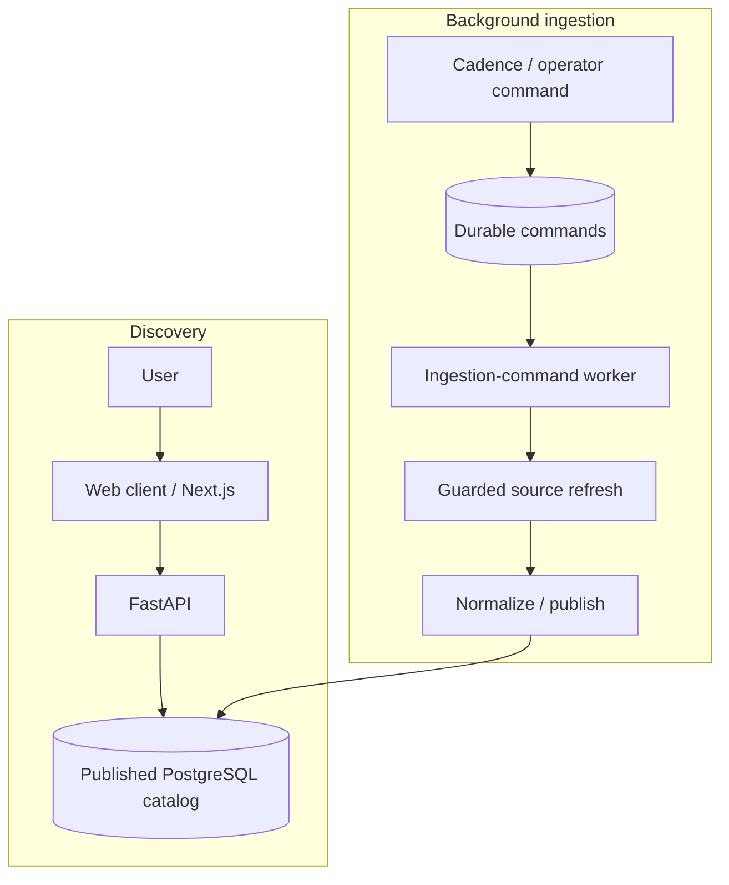

# Architecture

Events Concierge publishes a catalog of events for private discovery and provider
handoff. The current release supports search, filters and Events/Map/Calendar views.
Broader registration and calendar lifecycle code remains gated; its presence does not
make those capabilities part of the current release. The [current milestone](PROJECT.md#current-milestone-private-discovery-candidate)
and [release acceptance](docs/production-operations.md#first-release-acceptance) define that boundary.

## Code map

The Python package uses ports and adapters: domain logic is independent of I/O, application
services depend on typed ports, and composition selects concrete implementations.

| Location | Responsibility |
| --- | --- |
| `web/app/`, `web/components/`, `web/lib/` | Next.js pages, interaction components and same-origin API proxy routes. |
| `src/events_concierge/api/` | FastAPI intake, discovery, account and operator contracts; retained static consumer/admin surfaces. |
| `src/events_concierge/domain/` | Entities, values, policies and state transitions without external I/O. |
| `src/events_concierge/ports/` | Typed contracts for persistence, providers, authorization and other system boundaries. |
| `src/events_concierge/application/` | Use cases, ingestion execution, durable delivery, publication and lifecycle coordination. |
| `src/events_concierge/adapters/` | PostgreSQL repositories, provider/source adapters, pacing, authentication and local mocks. |
| `src/events_concierge/composition.py`, `catalog_runtime.py`, `runtime.py`, `config.py` | Dependency construction, catalog executor separation, deployment-provided boundaries and validated settings. |
| `src/events_concierge/workflows/`, `workers/` | Temporal workflows/activities and process entrypoints for background work. |
| `src/events_concierge/infra/`, `migrations/` | Database transaction scopes, models, logging and schema evolution. |
| `tests/`, `web/tests/` | Unit, behavior, integration, browser, deployment and recovery contracts. |
| `deploy/`, `deployment/`, `infra/terraform/`, `scripts/development/` | Application deployment, runtime configuration and operational tools. |

For discovery changes, start at the web route/component, follow the API into application
services and ports, then inspect its PostgreSQL adapter. For a source change, start at
the registered adapter and guarded catalog refresh path. For runtime wiring, start at
`composition.py` or `catalog_runtime.py`; avoid introducing provider selection into domain code.

## Runtime flows

Discovery reads the published catalog; a consumer search does not trigger live provider
scraping. PostgreSQL with pgvector owns application/catalog state. Redis coordinates shared
pacing. Object storage holds durable payloads and media where the selected runtime provisions it.

Cadence and operator requests enqueue durable ingestion work. The command worker in
`workers/ingestion_commands.py` claims bounded work under its executor role and uses
`application/ingestion_command_execution.py` plus the catalog refresh router. Reviewed
source modes run through the appropriate direct or Temporal refresh path; a queued
workflow is not proof that new catalog data was published.

The Temporal service stores workflow execution history; Python workers in
`workflows/worker.py` execute registered workflows and activities. Catalog and transactional
worker roles have distinct task queues and composition. Database leases, policy checks and
effect authority remain necessary even when Temporal retries an activity.

Symphony is separate developer infrastructure: it schedules coding agents against GitHub
tasks using [WORKFLOW.md](WORKFLOW.md). It is not a product worker, request scheduler or
replacement for the application's Temporal service.

## Invariants

- **Tenant boundaries:** `infra/db.py` establishes explicit tenant/system transaction scopes;
  PostgreSQL RLS and distinct operator/executor roles enforce the relevant data boundaries.
- **Provider access:** admit reviewed, enabled sources before egress; enforce shared pacing,
  bounded calls and the source's policy. Normalization and publication happen behind a lease
  fence, preserving the last successful projection if a new run fails.
- **Durable effects:** pending work, idempotency and effect ownership live in durable state.
  A retry or workflow acknowledgement does not make a remote mutation exactly once.
- **Runtime selection:** composition validates required deployment-provided ports and fails
  closed. Local mock behavior does not prove production identity, CSRF or provider access.
- **Release identity:** source, CI results, candidate images and review evidence must refer to
  the intended revision. Deployment acceptance requires runtime checks in its target environment.

## Development and ownership

Local development uses Docker Compose; the private GCP deployment uses application Helm
charts and separate data/runtime configuration. The shared foundation, networking and GKE
cluster are owned by [gcp-foundation](https://github.com/iliazlobin/gcp-foundation), independently
of this application's resources, identities and data. See [private deployment and recovery](deploy/development.md)
for the application boundary and retained recovery resources.

Assigned coding workspaces must isolate source, dependencies and outputs. The current
Compose defaults share a project name and host ports, and Makefile service-test targets
use fixed endpoints. Per-task source isolation therefore does not establish runtime
isolation; the initial Symphony workflow delegates service-backed checks to CI.

Use [AGENTS.md](AGENTS.md) for routine checks and task boundaries. Add or update meaningful
tests at the affected boundary, including failure behavior. Integration tests use
`tests/support/run_isolated_integration.py` to create and remove a validated disposable
database; never substitute the retained application database. Browser fixtures do not
prove deployed authentication or real provider behavior.

Detailed requirements and design live in [design/](design/); accepted architectural
decisions live in [decisions/](decisions/). Consult them for the affected component, while
applying the current release scope above. Keep this map current when ownership or major
boundaries change; put implementation detail beside the owning code and tests.
