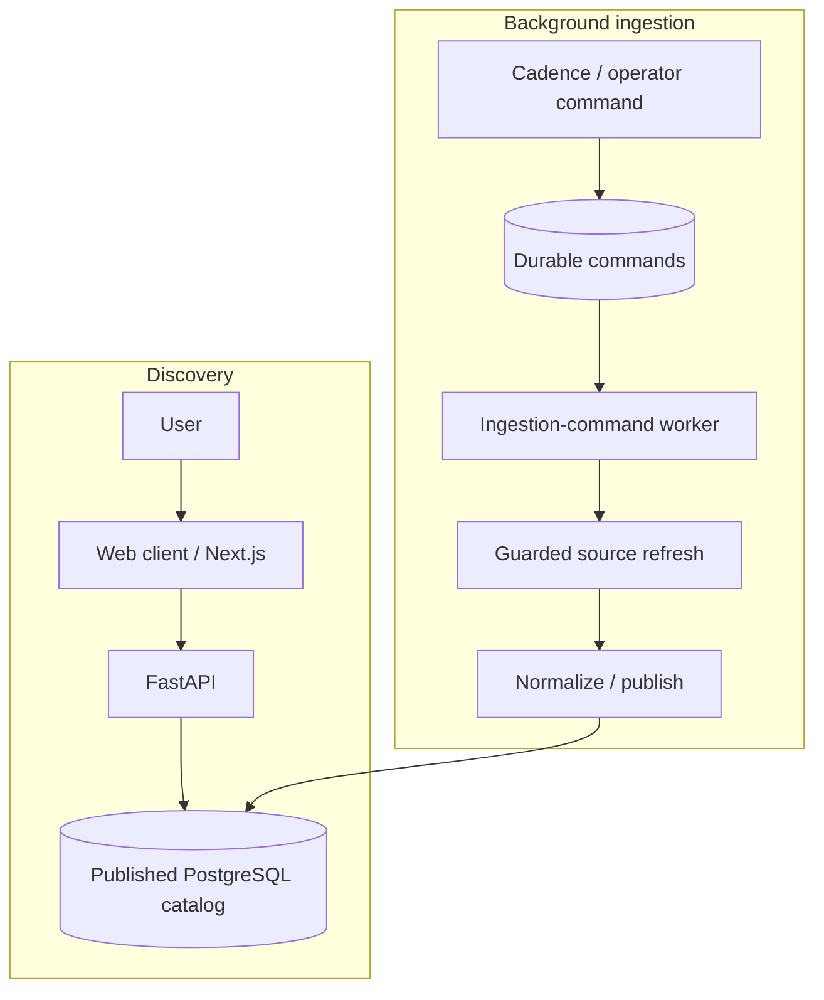

# Architecture

- **Product:** event discovery and provider registration links.
- **Current surface:** search, filters, profiles, Events/Map/Calendar and read-only entity graphs.
- **Deferred lifecycle:** registration, notifications and calendar synchronization remain gated.
- [Current milestone](PROJECT.md#current-milestone-discovery) and [release acceptance](docs/production-operations.md#first-release-acceptance) define scope.

## Code map

Ports and adapters: domain logic has no external I/O; application services use typed ports; composition selects implementations.

| Location | Responsibility |
| --- | --- |
| `web/app/`, `web/components/`, `web/lib/` | Next.js pages, components and same-origin API proxy |
| `src/events_concierge/api/` | FastAPI discovery, account, intake and operator contracts; static fallback surfaces |
| `src/events_concierge/domain/` | Entities, values, policies and state transitions |
| `src/events_concierge/ports/` | Typed persistence, provider and authorization contracts |
| `src/events_concierge/application/` | Use cases, ingestion, publication and durable lifecycle services |
| `src/events_concierge/adapters/` | PostgreSQL, source/provider clients, pacing, auth and mocks |
| `src/events_concierge/composition.py`, `catalog_runtime.py`, `runtime.py`, `config.py` | Runtime construction, executor separation and settings validation |
| `src/events_concierge/workflows/`, `workers/` | Temporal workflows/activities and background process entrypoints |
| `src/events_concierge/infra/`, `migrations/` | Transaction scopes, models, logging and schema evolution |
| `tests/`, `web/tests/` | Unit, integration, behavior, browser and operations contracts |
| `deploy/`, `deployment/`, `infra/terraform/`, `scripts/development/` | Application deployment, configuration and operations |

- **Discovery change:** web route → API → application service/port → PostgreSQL adapter.
- **Source change:** registered adapter → guarded catalog refresh.
- **Runtime change:** `composition.py` or `catalog_runtime.py`; provider selection stays outside domain code.
- **Consumer identity:** `web/lib/consumer-identity.ts` → `api/app.py` → `adapters/identity_platform.py`; `adapters/postgres/consumer_accounts.py` and migration `0207` bind accounts/legal receipts; `0208` adds account creation without consent when legal acceptance is deferred. Redis stores sessions. The selected operator edge uses Google IAP; the API independently verifies its signed assertion and configured owner role. [Release contract](deployment/consumer-identity.md).

## Runtime flows

Discovery and entity graphs read published data. Background ingestion refreshes reviewed sources independently; graph browsing never fetches external profiles.

The [entity-intelligence worker](docs/social-profile-enrichment.md) optionally refreshes known
social profiles through official APIs. Imported links and fetched snapshots are separate;
discovery reads persisted facts without contacting social providers.

| Component | Owns |
| --- | --- |
| PostgreSQL / pgvector | Application state, catalog and durable work |
| Redis | Shared pacing and configured session control |
| Object storage | Durable payloads and media where provisioned |
| Ingestion-command worker | Bounded command claims under the executor role |
| Temporal service | Workflow history and task coordination |
| Python Temporal workers | Workflow/activity execution; separate catalog and transactional queues/composition |
| Symphony | Coding-agent tasks through [WORKFLOW.md](WORKFLOW.md); separate from product orchestration |

- Command execution: `workers/ingestion_commands.py` → `application/ingestion_command_execution.py` → refresh router.
- Reviewed source modes select direct or Temporal refresh. A queued workflow does not prove catalog publication.
- Temporal execution: `workflows/worker.py`. Database leases, policy checks and effect authority still apply to retries.

## Invariants

- **Tenant isolation:** explicit tenant/system scopes in `infra/db.py`; PostgreSQL RLS and distinct operator/executor roles.
- **Guest/account boundary:** catalog reads are public; profiles, preferences and saved filters require a verified account and legal acceptance when configured as required. Consumer identity never grants production admin access.
- **Provider access:** reviewed, enabled sources; policy admission, shared pacing and bounded calls before egress.
- **Publication:** lease-fenced normalization/publication; failed runs preserve the last successful projection.
- **Durable effects:** persisted pending work, idempotency and ownership. Retries do not guarantee exactly-once remote mutations.
- **Runtime selection:** required ports validated at startup; incomplete non-mock composition fails closed.
- **Release identity:** source, images, checks and review must match. Target-environment checks establish deployed acceptance.

## Development and ownership

- **Local:** Docker Compose. Fixed project/ports and test endpoints; source worktrees do not isolate runtime state.
- **GCP:** private application/data Helm workloads; selected consumer/admin exposure uses a global GCP Gateway, Certificate Manager and admin IAP. [Public access](deploy/public-access.md) owns routing; the [runbook](deploy/development.md) owns release and recovery.
- **Shared platform:** [gcp-foundation](https://github.com/iliazlobin/gcp-foundation) owns foundation, network and GKE cluster.
- **Application:** this repository owns application resources, identities and data.
- **Agent work:** isolated source, dependencies and outputs; initial Symphony service-backed checks run in CI.
- **Integration tests:** `tests/support/run_isolated_integration.py` creates/removes disposable databases; never use the retained application database.
- **Evidence limits:** mocks and browser fixtures do not prove deployed authentication or real provider behavior.
- [AGENTS.md](AGENTS.md): checks and task boundaries. [Runtime contracts](design/system-design.md): implementation constraints. [Notion design](https://app.notion.com/p/391d865005a88164a182eabc18fe068f): architecture and rationale.
