# Meetup ingestion design

**Status:** implemented for the reviewed anonymous city-page catalog slice; tenant OAuth
registration remains separately gated.

Meetup appears in two deliberately different trust domains. They share a provider name, but they do
not share credentials, data classification, persistence, or authorization.

| Surface | Purpose | Authority | Visibility | Current implementation |
|---|---|---|---|---|
| Public city-page JSON-LD | Discover tenant-neutral public events | Exact owner-reviewed HTTPS city URL | Shared catalog | Enabled for the reviewed San Francisco and New York registry rows |
| Meetup GraphQL OAuth | Read a user's membership/RSVP state and create an RSVP | That tenant's OAuth token and consent | Tenant only | Transport and guarded registration seam exist; production use remains G2-gated |

An event fetched through a tenant OAuth grant is never promoted to the shared catalog. Conversely,
the anonymous city-page fetcher never receives a token, reads member state, or performs an RSVP.

## Shared anonymous catalog flow

Migration `0126` adds the closed `meetup_city_jsonld` source mode and two reviewed registry rows.
Migration `0137` advances those exact rows to the reviewed bounded detail-enrichment contract:

| Source key | Reviewed page | Region | Refresh interval | Request-unit cap |
|---|---|---|---:|---:|
| `meetup-sf` | `https://www.meetup.com/find/us--ca--san-francisco/` | `bay_area_9_county` | 120 min | 41 |
| `meetup-nyc` | `https://www.meetup.com/find/us--ny--new-york/` | `new_york_metro` | 120 min | 41 |

Both sources are handoff-only. One request unit reads the exact city page; at most forty more read
canonical same-origin event pages asserted by that snapshot:

```mermaid
flowchart LR
    R[Reviewed source row] --> G[Registry, review, policy, pacing, and lease gates]
    G --> H[Exact city GET]
    H --> J[Root schema.org Event JSON-LD]
    J --> S[Deterministic candidate sort]
    S --> E[Up to 40 paced same-origin detail GETs]
    E --> I[Root Event identity gate plus bounded Details enrichment]
    I --> N[CandidateEvent normalization]
    N --> D[Canonical merge and current catalog projection]
    D --> C[Consumer browse, map, and calendar]
```

The fetch contract is intentionally closed:

- exact source key, seed URL, sole origin, handoff posture, and 41-unit cap must match the compiled
  reviewed profile;
- every city and detail request is anonymous, same-origin, paced, redirect-refusing, and bounded by
  a 20-second transport timeout plus a 2 MB UTF-8 `text/html` response cap;
- only `script[type="application/ld+json"]` root, root-list, or root-`@graph` objects whose type is
  `Event` are considered;
- application state such as `__NEXT_DATA__` is never traversed;
- event and organizer URLs must match the expected public Meetup event/group URL shapes;
- past, cancelled, and postponed events are excluded;
- duplicate event URLs must agree on title and start time; the richer safe record wins; and
- candidate order is deterministic before the forty-detail cap is applied.

The city page remains the atomic snapshot boundary. Missing/malformed city JSON-LD, endpoint drift,
an oversized city body, or conflicting city identity fails the refresh rather than publishing a
partial snapshot. Detail enrichment is deliberately best-effort: each detail page must repeat the
same event ID/canonical URL, normalized title, and UTC start time in root Event JSON-LD before any
new field can be used. A redirect, transport/envelope failure, malformed/missing Event block, or
identity mismatch preserves the validated city candidate and records only a closed status code.
Events beyond the detail cap are retained with `request_cap_not_fetched`; arbitrary provider errors
and HTML are never retained.

After identity validation, structured Event JSON-LD wins for price, registration, and location.
The adapter may also read only visible, server-rendered `p`/`li` text beneath the first exact
`Details` heading, bounded to 64 nodes, 2,000 characters per node, and 12,000 description
characters. It chooses the longest bounded city/detail/visible description; accepts visible price
only from exact `Cost:`/`Admission:` free or USD forms; and accepts `WHERE:` only when it parses as a
conservative US address. An **Attend** control never implies registration-open, and visible text
never overrides structured facts.

The adapter normalizes only public event facts: title, schedule, description, venue/address,
coordinates, organizer name and public group URL, image, public event URL, attendance mode,
event status, explicit offer/price range, currency, and registration availability. It emits the
shared `Source.PUBLIC_JSONLD` classification with a stable `meetup:<event-id>` source identity.
Source-registry provenance still identifies `meetup-sf` or `meetup-nyc`, so the consumer and admin
can show the actual provider/source without inferring it from the URL.

Safe scalar provenance is retained for operator and consumer projections; raw provider HTML and
application payloads are not stored or exposed by this slice.

## Explicit privacy boundary

The shared adapter does **not**:

- sign in, use cookies, or send a Meetup OAuth token;
- call Meetup GraphQL;
- follow arbitrary links: its only follow-up reads are the capped, canonical event URLs supplied by
  city Event JSON-LD; group, attendee, member, and redirect targets are refused;
- parse RSVP or attendee/member objects;
- ingest a named attendee roster, avatars, member profiles, or contact details;
- create, cancel, or modify an RSVP; or
- promote anything discovered under one user's OAuth grant into a tenant-neutral table.

Public organizer/host names and an explicitly supplied public organization URL are event metadata.
They are not evidence of attendance. Named attendee ingestion remains out of scope pending an
explicit consent, retention, erasure, redistribution, and provider-terms decision.

## Tenant-scoped OAuth/RSVP lane

The existing Meetup API adapter targets Meetup's HTTPS GraphQL endpoint and is designed around one
tenant's access token. Its mutation path reads membership and RSVP state before attempting
`createEventRsvp`, omits `member_id`, refuses browser RSVP, and routes ambiguous or ineligible cases
to handoff.

That lane remains disabled from default production composition until the G2 field gate verifies the
live schema, authorization behavior, quota scope, autonomous join constraints, and retry semantics
with a Meetup Pro OAuth consumer. Its fixture-only discovery method is not a public catalog source.
No shared-catalog claim should cite OAuth-derived data.

## Operations and scheduling

The source uses the ordinary catalog refresh control plane:

1. **admission** — registry, review, policy, pacing, and durable lease checks;
2. **collect** — the bounded adapter boundary, including transport;
3. **extract + enrich** — city parsing and any identity-checked detail evidence (currently included
   in the measured adapter boundary rather than timed separately);
4. **normalize + dedupe** — deterministic provider-neutral facts, topics/free provenance, and merge
   (currently included in the catalog commit boundary); and
5. **catalog publish** — one lease-fenced atomic current-catalog commit.

The 41-unit `page_limit` feeds the refresh-lease budget as well as the adapter cap. Migration `0136`
derives deterministic topic facets and conservative free inference with bounded evidence; Meetup's
explicit JSON-LD keywords and enriched description are inputs to that shared normalizer, not a
provider-specific semantic model.

In local/mock composition, the separate cadence process probes every five minutes and queues at most
one durable `refresh_due` command when any reviewed source is due. It never fetches Meetup itself.
The command worker and catalog dispatcher own execution. Production must provide its own reviewed
scheduler for the one-shot dispatcher; the local cadence process is not production scheduling
authority.

See [the Meetup ingestion runbook](../docs/meetup-ingestion-runbook.md) for enablement, refresh,
verification, and containment steps.
