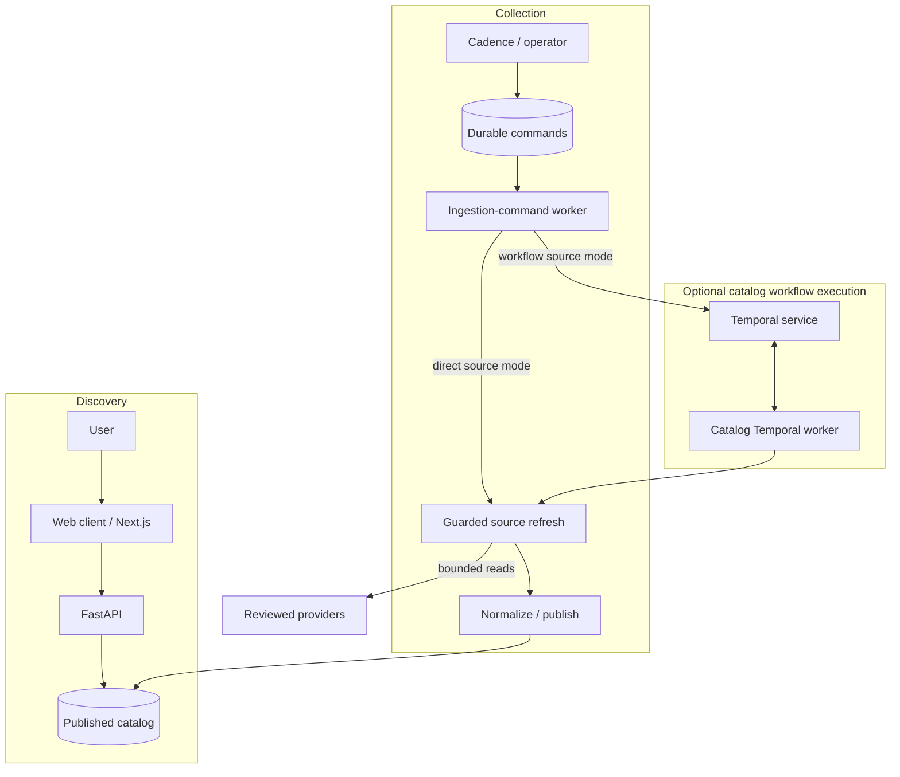

# System design

Accepted design for the private discovery release. [PROJECT.md](../PROJECT.md#current-milestone-private-discovery-candidate) owns product scope; [ARCHITECTURE.md](../ARCHITECTURE.md) maps code and processes.

## Product boundary

- Search, shared filters, Events/Map/Calendar, event details and provider registration links.
- Profiles, interests and saved filters belong to the authenticated tenant.
- Registration happens on the provider's site; catalog entries do not establish an RSVP.
- `EC_RELEASE_PROFILE=discovery` removes deferred API routes and selects the discovery interface. [Route contract](../src/events_concierge/api/release_profile.py).
- `EC_MOCK_CLOUD` independently selects integration behavior; mock-backed deployments remain development candidates.
- Chat, autonomous RSVP, managed handoffs, notifications, Calendar synchronization, purchases and programmatic API keys remain deferred.
- Google sign-in, datastore TLS and self-hosted Temporal mTLS are implemented; deployment acceptance remains pending.

## Components and data flow

| Component | Responsibility |
| --- | --- |
| Next.js | Web application; same-origin proxy to internal FastAPI endpoints. |
| FastAPI | Bounded discovery/account APIs, authentication and commands. |
| PostgreSQL / pgvector | Published catalog, tenant state, source provenance, durable commands and ownership fences. |
| Redis | Shared provider pacing and configured opaque-session authority. |
| Catalog workers | Claim commands, admit sources, fetch bounded data, normalize and publish. |
| Temporal service | Durable workflow history, timers and task coordination. |
| Python Temporal workers | Separate catalog and transactional workflow/activity execution. |
| Object storage | Configured payload/media storage with separate catalog and tenant claim-check namespaces. |
| Operator API | Separate authenticated operational projections and reviewed catalog controls. |

- Reads use published data. Direct and Temporal refresh share admission and publication controls.
- Domain logic has no external I/O; application services use typed ports; composition selects adapters.
- Startup validates required ports and rejects incomplete non-mock composition. [Runtime](../src/events_concierge/runtime.py).
- PostgreSQL owns application truth. Temporal execution and retries do not replace database authority.
- Symphony manages coding tasks separately; it is not an application process. [Agent workflow](../WORKFLOW.md).

## Catalog and ingestion

**Read contract**

- Browse reads admitted, reviewed, enabled, non-fixture observations; it never scrapes, queues collection or changes cadence.
- Current/future results require the source's latest successful refresh; explicit past ranges may include retained observations after crawl rolloff.
- Retained history exposes latest-known state, not historical versions or complete archive coverage.
- Omitted dates mean future-only browse. Explicit timezone-aware bounds form an end-exclusive interval.
- All-source ranges are bounded to 370 days; selected-source archives to 7,305 days.
- Filters precede keyset pagination; opaque cursors bind the complete filter scope.
- Selected cities/areas form an additive union; other dimensions intersect. Multiple topics require every selected topic.
- Calendar navigation preserves explicit filters and clears the cursor. [Browse/history contract](catalog-browse-history.md).

**Event and entity facts**

- Canonical identities retain observation provenance, provider-specific identities and registration URLs through deduplication.
- Structured provider facts take precedence. Unknown price or availability stays unknown without qualifying evidence.
- Topics are deterministic; provenance identifies the source field and rule. [Event semantics](catalog-event-semantics.md).
- Tenant-credentialed provider data stays tenant-scoped; it never becomes shared catalog data.
- Entity mentions retain their asserting event, source and role.
- Name-only entities stay source-scoped; names establish neither verified identity nor cross-source equivalence.
- Verified identities support bounded public-source reads. LinkedIn scraping and attendee rosters remain excluded.
- Credentialed enrichment requires reviewed terms, scoped credentials and operator approval. Workers cannot approve their own evidence.
- [Entity catalog](entity-catalog-and-research.md) and [enrichment controls](entity-enrichment-control-plane.md) own identity, attribution and provider contracts.

**Collection contract**

1. Cadence appends idempotent commands for due work; it never contacts providers.
2. The ingestion-command worker freezes a bounded plan and executes one source per claim.
3. Preflight requires a known, reviewed, enabled, policy-admitted source and registered adapter.
4. Shared Redis pacing precedes egress; transport, pages, response sizes and retries remain bounded.
5. Renewable database leases identify ownership; lost renewal cancels work and forbids stale completion.
6. Normalization, deduplication and publication commit behind the source lease fence.
7. Failed refreshes preserve the last successful projection. Queued commands/workflows do not prove publication.

- Continuations release leases; database-clock availability lets waiting manual work run between fleet sources.
- Source policy controls URLs, origins, modes and budgets; commands cannot bypass admission.
- Anonymous Meetup collection reads one reviewed city page plus at most 40 identity-checked, same-origin event pages.
- Meetup collection excludes credentials, redirects, application state, member/RSVP data and arbitrary links. [Meetup contract](meetup-ingestion.md).
- Local cadence uses a daemon; hosted cadence uses the chart's one-shot CronJob. Temporal Schedule cutover is inactive.
- [Ingestion administration](../docs/ingestion-admin.md#execution-model) owns retry budgets, queue continuation, stage measurements and provenance interpretation.

## Identity and authority

- Browser traffic stays same-origin; credentials remain server-side; request bodies cannot select tenant authority.
- Built-in OIDC verifies issuer, audience, subject, nonce and PKCE; accounts require provisioning.
- Google identities bind verified `sub`, never email. An unknown or erased subject cannot sign in.
- Redis owns sessions; secure cookies carry opaque handles. Logout revokes sessions before clearing cookies.
- Authenticated mutations require the exact configured Origin and matching session-bound CSRF cookie/header.
- Local fixture tenant headers and onboarding exist only in mock composition.
- Tenant reads use scoped transactions, explicit predicates and PostgreSQL RLS; application logins cannot bypass RLS.
- Profile/preferences writes use revision checks. Saved filters retain tenant ownership. [Profile port](../src/events_concierge/ports/tenant_profile.py), [saved-filter port](../src/events_concierge/ports/saved_catalog_filters.py).
- Consumer projections exclude workflow identities, capabilities, credentials and notification/audit payloads.
- Hosted operators use a separate API, verified IAP assertions and assigned viewer/operator/reviewer roles.
- Operator/executor database roles are separate from consumer authority. Local admin remains loopback/mock-only.
- New adapters/source onboarding require reviewed changes. [Operator boundary](../docs/ingestion-admin.md#hosted-operator-boundary).
- Secrets stay outside prompts, logs and histories; payload references enforce namespace, identity and size checks.
- [Identity operations](../docs/production-operations.md#built-in-oidc-bff-activation) owns configuration, cookie limits, provisioning and field acceptance.

## Account erasure

- Non-mock erasure requires typed confirmation and recent authentication bound to session, tenant, subject and purpose.
- Google destructive-action reauthentication is unsupported; account deletion fails closed. Ordinary sign-in cannot substitute.
- Acceptance commits a permanent tombstone and immutable external-target inventories under the tenant advisory lock.
- The same lock guards external effects; admitted operations settle before inventory capture.
- Cancellation retains authority until admitted work finishes; transport deadlines bound provider calls.
- The tombstone rejects ordinary writes; acceptance reports cleanup underway, not completed deletion.
- A separately leased worker resumes idempotent stages: effect drain, workflow histories, Calendar artifacts, vault, objects and sessions.
- Database deletion follows all successful external stages. Unavailable cleanup leaves the tenant fenced and pending.
- A PII-free tombstone remains for replay and non-reprovisioning. [Erasure contract](../src/events_concierge/ports/account_erasure.py).
- Missing addressable Temporal histories do not prove physical removal from backups, archives or exports.
- Calendar watches need durable cleanup before activation. Provider and retention cleanup require deployment evidence.

## Deferred concierge contracts

These constraints apply to a separately authorized full-product release; retained code does not enable them in discovery.

| Boundary | Contract |
| --- | --- |
| Request intake | Request/start-outbox commit; request-start worker retries duplicate-safe starts. Acceptance means saved, not registered. |
| Orchestration | Parent owns bounded candidate attempts; per-tenant/event children own registration and lifecycle. [ADR-003](../decisions/adr-003-two-tier-orchestration.md). |
| Lifecycle truth | Guarded database transition commits state, ledger and outbox together. [ADR-007](../decisions/adr-007-db-anchored-lifecycle.md). |
| Remote mutations | Recheck consent, policy, ownership and remote state. Recover ambiguous outcomes; retries cannot guarantee exactly-once effects. |
| Browser execution | Isolate sessions; pin origin before decrypt; deny unapproved egress; separate untrusted reading from privileged actions. [ADR-006](../decisions/adr-006-managed-fleet-sovereign-trust-plane.md). |
| Handoffs | Completion requires independent verification. Capability GET is inert; authorized POST signals work. Fuzzy evidence cannot auto-complete. |
| Calendar/change delivery | Deterministic keys, conflict checks, event-keyed detection; change-delivery worker signals workflows. [ADR-008](../decisions/adr-008-central-change-detection.md). |
| Notifications | Notification worker delivers pending work with bounded retry/deduplication. Enqueue does not establish delivery. |
| Credentials/mail | No Gmail access. Provider terms and revocable tenant consent constrain every action. [ADR-011](../decisions/adr-011-relay-inbox-no-gmail.md). |

- Browser fleet, credential broker, notification and Calendar integrations require separate provisioning and acceptance.
- [Requirements](requirements.md) and [ADRs](../decisions/README.md) retain full-product contracts, sizing and targets; these do not establish discovery deployment behavior.

## Deployment and acceptance

- Shared [GCP foundation](https://github.com/iliazlobin/gcp-foundation) owns networking and GKE; this application owns workloads, identities, data and recovery.
- Release immutable Python and Next.js images with compatible schema, configuration and worker code.
- `/healthz`: liveness. `/readyz`: dependencies. `/versionz`: build identity. Healthy processes do not establish user-flow acceptance.
- Required evidence covers real identity/CSRF, tenant isolation, catalog publication, worker recovery, monitoring and backup restoration.
- Deferred routes, workers and credentials remain disabled; retained work must not resume prohibited external effects.
- [Production operations](../docs/production-operations.md#first-release-acceptance) owns release gates; [private deployment](../deploy/development.md) owns release, access and recovery commands.
- Deployment requires separate authorization from source integration and migration.
