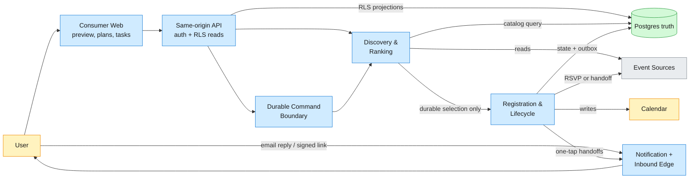
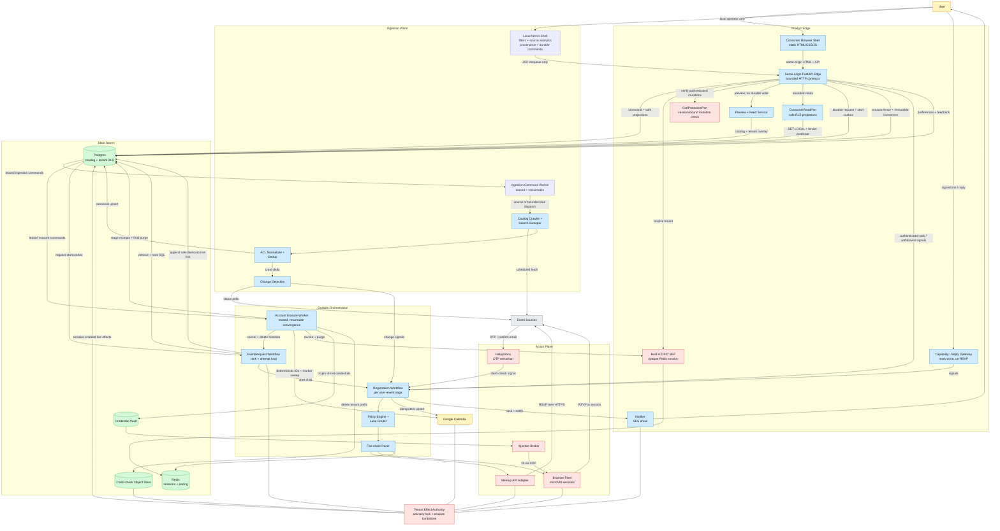
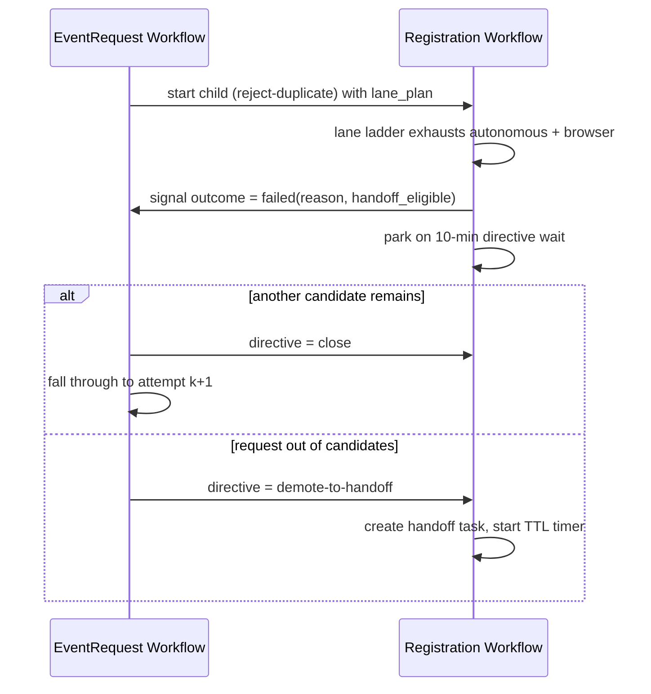
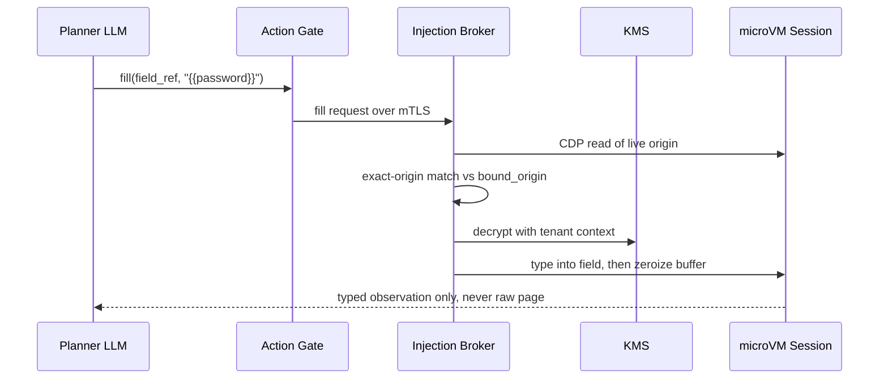
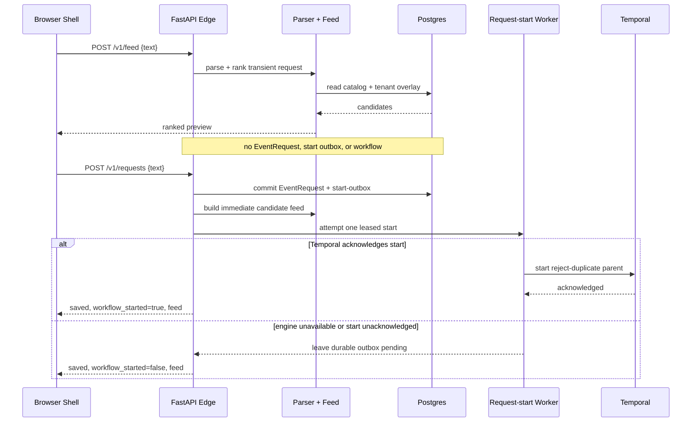

## 1. Problem

Turn a natural-language ask — "find me something Friday evening after work and sign me up" — into a confirmed, reconciled calendar entry, for many users at once. For each request the system discovers candidate events across heterogeneous sources (API connectors where a source has one, browser automation and a cross-source search funnel where it doesn't), ranks them against the requesting user's stored taste and hard constraints, autonomously registers where the source's terms and technical surface permit, writes the confirmed event to the user's calendar behind a conflict gate, and keeps that entry true afterward — reconciling organizer cancels and reschedules, and honoring user withdrawals. The consumer product is a same-origin web shell over authenticated, tenant-scoped API contracts: it separates a read-only catalog preview from durable handling, projects request/lifecycle/handoff truth from Postgres without querying Temporal histories, and submits commands through the existing durable boundaries. The product ships the honest split: discovery, ranking, calendar, and reconciliation are always autonomous across every source; autonomous RSVP runs only where permitted (Meetup groups the user already belongs to, on the reliability SLA; Luma via browser, best-effort, off it); everywhere else the user gets a pre-filled one-tap handoff task as a first-class outcome, not a failure state. It is deliberately not an autonomous paid-ticket purchaser (the payment port ships stubbed and disabled), not a single-user script (it is a multi-tenant service holding other people's credentials), and not a terms-evading scraper (compliance is human-cadence pacing and quarantine-on-ban, never IP rotation).



## 2. Requirements

**Functional**
- FR1: Preview ranked candidates without durable side effects, or submit a durable natural-language request and track its accepted state honestly.
- FR2: Connect event accounts and calendars with per-source, revocable consent.
- FR3: Autonomously RSVP to the best free candidate where sources permit.
- FR4: See restricted-registration tasks and submit an explicit, independently verified mark-done through either the signed email capability or an authenticated product session.
- FR5: Show each confirmed event once on the calendar, whatever source found it.
- FR6: Show lifecycle-backed plans, reconcile organizer changes, and accept user withdrawals through the durable command path.

**Non-functional**
- NFR1: Ranked response p95 ≤ 5 s; new events discoverable within 6 h.
- NFR2: No duplicate RSVP or calendar write across crashes and retries.
- NFR3: Zero cross-tenant leakage; secrets never appear in prompts, stored state, or logs.
- NFR4: Failures degrade to a handoff task within 60 s, never a prohibited action.
- NFR5: Consumer responses expose no workflow identities, completion capabilities, credentials, or audit payloads; every tenant read is RLS-scoped and bounded.

**Out of scope:** paid ticket purchase, native mobile applications and offline synchronization, Microsoft/Apple calendar adapters, multi-region HA, Partiful and Eventbrite autonomous registration.

## 3. Back of the envelope

- **Interactive load:** 100k users × ~4.5 requests/wk ≈ 450k/wk, concentrating into a Friday-evening peak of ~750 req/min ≈ 12.5 QPS, over a catalog of 150–500k active events (single-digit GB with embeddings) — compute is never the bottleneck; external source quotas are.
- **Shared-key crawl budget:** 25 metros × 5 segments × 2 date windows × ~2 pages × 4 cycles/day ≈ 2,000 Ticketmaster calls/day against a fixed 5,000/day shared app key — the daily budget, not the 5 rps cap, binds.
- **Browser concurrency:** 45,000 req/hr peak × 40% RSVP conversion × 30% browser share × 90 s/session ÷ 3,600 ≈ 135 concurrent sessions at 100k users (~13 at launch) — pool saturation is the operational ceiling, not model throughput.

## 4. Entities

```sql
Tenant {
  tenant_id:      uuid PK
  oidc_subject:   string CK
  notify_email:   string
  relay_inbox:    string CK      ← alice@u.<domain>; inbound-only OTP/confirmation channel
  policy:         jsonb          ← per-user limits, autonomy dial, kill-switch flag
}

Credential {                      ← siloed vault; only the injection broker can decrypt
  credential_id:  uuid PK
  tenant_id:      uuid FK
  source:         enum
  kind:           enum           ← oauth_refresh / session_cookie / password_fallback
  ciphertext:     bytea          ← AES-GCM with tenant-bound local AAD; random unlinkable envelope-id KMS context
  bound_origin:   string         ← injection domain-pin target
  identity_hash:  string         ← egress IP slot + fingerprint at capture; cookie-reuse guard
  status:         enum           ← active / needs_reauth / revoked
}

ConsentRecord {
  consent_id:     uuid PK
  tenant_id:      uuid FK
  source:         enum
  scope:          string
  granted_at:     timestamp
}

CanonicalEvent {                  ← tenant-neutral catalog; no tenant column anywhere
  canonical_event_id: uuid PK    ← minted once, never reused; keys workflow and calendar ids
  title:          string
  start_at:       timestamp      ← always with IANA timezone
  venue_geo:      geo_point
  event_status:   enum           ← scheduled / cancelled / rescheduled
  embedding:      vector         ← vector index for hybrid retrieval
  merge_version:  integer        ← dedup replayable from retained raw at zero quota cost
}

EventSourceLink {
  source:         enum CK
  source_event_id: string CK
  canonical_event_id: uuid FK
  registration_url: string       ← every per-source URL retained on the merged event
}

SourcePolicy {
  source:         enum PK
  automation_allowed: jsonb      ← {api, browser} per modality; data, not code
  paid_allowed:   boolean
  quarantined:    boolean        ← ban circuit breaker
}

EventRequest {
  request_id:     uuid PK        ← hash(tenant, normalized text, time bucket); intake dedup
  tenant_id:      uuid FK
  raw_text:       text
  constraints:    jsonb          ← time window, geo, category, budget = free
  state:          enum
}

Lifecycle {                       ← one non-terminal row per (tenant, event); partial unique index
  lifecycle_id:   uuid PK
  tenant_id:      uuid FK
  canonical_event_id: uuid FK
  workflow_id:    string CK      ← {tenant}:{event}; pairs with engine-level reject-duplicate
  state:          enum           ← found…scheduled + completed/cancelled/expired/failed_no_candidate
  lane:           enum           ← autonomous / browser / handoff; SLA math reads this tag
}

HandoffTask {
  task_id:        ulid PK
  tenant_id:      uuid FK
  workflow_id:    string FK
  reason:         enum           ← browser-fail / captcha / approval-gated / dues / saturation / paywall
  deep_link:      string
  ttl_expires_at: timestamp      ← min(7 days, event start)
  state:          enum           ← open / notified / completed / expired / cancelled
}

AuditEntry {                      ← append-only operational identity; only erasure may shred PII
  audit_id:       bigint PK
  tenant_id:      uuid
  workflow_id:    string
  idempotency_key: string
  policy_decision: string
  consent_ref:    uuid? FK       ← NULL after the erasure fence
  pii_shredded_at: timestamp?
  outcome:        enum
}
```

### API

**Implemented consumer and service contracts**

- `GET /` and `GET /app` — same-origin consumer shell; allowlisted `/assets/*`, manifest, and favicon are packaged in the API image
- `GET /healthz`, `GET /readyz` — process liveness and database-authoritative readiness; Temporal unavailability is reported as durable degradation, while an unavailable built-in BFF session store removes the replica from service
- `GET /versionz`, `GET /metrics` — release/build identity and bounded Prometheus process/dependency/queue telemetry; production deployment metadata must supply immutable revision/digest evidence, and the deployment must restrict metrics at the edge
- `GET /v1/ui-config` — non-secret product/auth-mode bootstrap; production exposes only the repository-owned same-origin login, reauthentication, logout, and CSRF names
- `GET /auth/login`, `POST /auth/reauth`, `GET /auth/callback`, `POST /auth/logout` — repository-owned OIDC authorization-code BFF with one-shot state/nonce/S256 PKCE transactions, Redis-backed opaque sessions, exact-origin CSRF, purpose/session/tenant/subject-bound destructive-action step-up, and revocation
- `POST /v1/onboard` — local-fixture account creation, registered only when `EC_MOCK_CLOUD=true`; absent from production composition
- `GET /v1/me`, `PUT /v1/preferences` — account projection and optimistic, whole-profile explicit-interest replacement
- `POST /v1/feed` — read-only catalog preview; parses and ranks but does not persist an EventRequest or start a workflow
- `POST /v1/feed-feedback` — replay-safe click/dwell/dismiss preference signal
- `POST /v1/requests`, `GET /v1/requests` — durable intake plus bounded recent-request projection; `workflow_started=false` means the committed start-outbox row still awaits worker/engine acknowledgement, while an optional `outcome` appears only after the parent immutably links its selected lifecycle
- `GET /v1/registrations`, `GET /v1/tasks` — bounded lifecycle-backed Plans and handoff projections; actionable tasks exclude absolute-TTL-expired rows
- `POST /v1/me/tasks/{task_id}/done` — authenticated, tenant-bound mark-done; returns only after the lifecycle signal is durably acknowledged
- `GET /v1/tasks/{token}/done`, `POST /v1/tasks/{token}/done` — email capability flow; GET is inert confirmation and only POST signals completion
- `POST /v1/unrsvp` — authenticated withdrawal command against the RLS-visible active lifecycle
- `POST /v1/me/erasure-requests` — exact typed confirmation plus recent provider authentication in production; atomically fences the account, returns accepted durable progress, and clears current browser credentials while the leased erasure worker converges independently
- `GET /admin` plus `GET /admin/v1/ingestion/{overview,filters,sources,runs,commands}` — explicitly local/mock-only ingestion control room with compact tabbed workspaces, counted registry facets, server-bounded run windows, fixture-aware operational projections, and exact-source deep links; overview v2 derives live-running counts from normalized, unexpired source/command lease facts and counts only each source's latest unresolved failure in the 24-hour failure total. `GET /admin/v1/ingestion/sources/{source_key}` joins reviewed configuration, bounded history buckets, yield/duration summaries, recent runs, and honest build/source provenance. Consumer tenant identity grants no access.
- `POST /admin/v1/ingestion/commands` — local operator command acceptance for one source refresh or one bounded due-source pass; the request only commits a leased queue row and returns `202`, while the independent ingestion-command worker invokes the existing policy/pacer/refresh boundaries. Workers hold a 300-second command lease and renew only the exact live command/token pair every `min(60 seconds, lease / 3)`. Renewal failure means authority is lost: the provider operation is cancelled and the worker records no terminal command mutation, leaving expiry/reclaim as the sole recovery path. A one-source Pacer defer is returned to the same durable command/run identity at a database-clock `available_at`, lease-fenced and capped at five attempts, so a cold shared bucket cannot strand a manual command and no worker sleeps on the delay.

Consumer DTOs deliberately omit workflow identifiers, completion capabilities, notification/audit payloads, and provider credentials. Offset cursors are opaque to clients, API pages are capped at 50 items, and command responses expose product status rather than orchestration routing data.
Admin DTOs likewise omit database lease tokens and raw provider error bodies. The admin cannot edit
registry URLs/origins, source review, enablement, quarantine, or policy. The current surface is not a
production operator plane: non-mock settings reject activation. A future production plane requires
a distinct operator identity, CSRF/recent-authentication policy, and isolated database authority.
New source-specific admin commands snapshot the admitted source revision plus accepting API
release/image identity. A later leased worker claim records its own source/release/image identity,
and the stable `admin:<command UUID>` run key enables a bounded projection join. This is labeled
`claim_recorded`: routing may queue Temporal or observe an already-finished run, so it is not
misrepresented as proof that the claiming process performed the fetch. Unattributed historical
work stays `legacy_unavailable`, and source-revision-only cadence/manual work is not misrepresented
as release- or worker-attributed. Local `-dirty` builds and digest-free builds are visibly mutable,
and before/after outcome charts are explicitly observational rather than causal claims.

**Planned contracts, not implemented by the current product edge**

- `POST /v1/sources/{source}/connect` and `DELETE /v1/sources/{source}` for account linking and single-source disconnect
- Optional push/SSE or a separately capacity-budgeted long-lived Plan refresh if later product requirements need lower latency or automatic organizer-change rendering beyond the implemented pending-request convergence loop

## 5. High-Level Design



#### FR1: Natural-language request to ranked candidates

- **Components:** Consumer Browser Shell → same-origin FastAPI/AuthContext edge → Preview + Feed Service or durable Request Intake → Postgres (catalog + tenant overlay + start outbox) → EventRequest Workflow → rank stack.
- **Flow:**
  1. The browser makes the authority choice explicit. `POST /v1/feed` is a preview: it parses and ranks against the persisted catalog, returns a transient request id and candidates, and writes neither an EventRequest nor a workflow start. `POST /v1/requests` means "find and handle it" and crosses the durable boundary.
  2. Durable intake (the authenticated API today; email/SMS adapters may target the same service later) dedups on `hash(tenant, normalized_text, time_bucket)`, which deterministically mints `request_id`; it commits the EventRequest and a tiny start-outbox row before attempting a reject-duplicate workflow start. `workflow_started=false` is an honest queued state, not failure or registration success: the worker starts the same parent after Temporal recovers.
  3. A schema-constrained parser turns the text into `constraints` (time window, geo radius, category, budget = free) plus an intent embedding; durable replay reconstructs the omitted derived embedding without putting request text or vectors into workflow history.
  4. Discovery fans out per source port: catalog-backed sources (Ticketmaster, the search funnel) are read straight from Postgres — zero live calls; per-user sources (Meetup, Luma) run under the requesting user's own stored token through the fair-share pacer, on a 2 s budget with stale-while-revalidate — a slow source serves its last-known working set and backfills asynchronously, so one slow source cannot push the response past the 5 s bound.
  5. Retrieval is one SQL statement on the read replica, under `SET LOCAL` tenant context — the tenant-neutral catalog `UNION ALL` the requester's RLS-scoped overlay, both legs filter-pushed on time/geo/free:
  ```sql
  WITH dense AS (
    SELECT canonical_event_id, row_number() OVER (ORDER BY embedding <=> :intent) AS r
    FROM candidates LIMIT 200),
  sparse AS (
    SELECT canonical_event_id, row_number() OVER (ORDER BY ts_rank_cd(tsv, :query) DESC) AS r
    FROM candidates LIMIT 200)
  SELECT canonical_event_id, sum(1.0 / (60 + r)) AS score     -- RRF, k = 60
  FROM (TABLE dense UNION ALL TABLE sparse) fused
  GROUP BY 1 ORDER BY score DESC LIMIT 150;
  ```
  6. The fused 100–200 candidates pass through a cross-encoder rerank (80–150 ms), a per-user gradient-boosted re-scorer over taste features, and an optional listwise tie-break over only the top 10.
  7. A `freeBusy` read across the user's connected calendars gates the result: a hard overlap marks the candidate BLOCKED — it can rank, but it can never be attempted; near-adjacent and tentative conflicts only demote.
  8. After one child has committed the selected registered or handoff outcome, the parent resolves that child's stable lifecycle and appends one tenant-consistent `request_outcome_links` row. Exact activity replay converges; an attempt to rebind the request to another lifecycle is non-retryable. `GET /v1/requests` joins through that explicit link and reads only allowlisted selected-or-later lifecycle states, while legacy, pending, no-result, malformed pre-selection, or failed-attempt links remain outcome-free.
- **Design consideration:** preview and durable intake deliberately share parsing/ranking but not state authority. The interactive path makes zero live shared-key calls, so an added tenant adds nothing to the crawl budget and the p95 stays ~2.5 s against the 5 s bound. Staleness between crawl cycles is tolerated by design: the execution-time guards in FR3 re-verify everything that matters before any side effect, so a stale candidate costs at most one attempt of the fall-through budget instead of a wrong action.

#### FR2: Connect accounts and calendars

- **Components:** Intake Gateway (BFF) → Credential Vault + Consent records → RelayInbox provisioning → credential health prober.
- **Flow:**
  1. Users authenticate over OIDC with a backend-for-frontend: the browser holds only an httpOnly session cookie, third-party tokens never leave the server, and `tenant_id` is a signed claim resolved once at the edge. Onboarding provisions the per-user RelayInbox address and binds it to the tenant.
  2. OAuth sources (Meetup, Google) use the standard code flow — exactly one refresh token per user per client id, never a stored password, and incremental authorization: the calendar write scope is requested only when the first event is actually scheduled.
  3. Browser-only sources (Luma) link through a first-login handoff: the user signs in once, the injection broker captures the resulting short-TTL session cookie over CDP directly into the vault — it never transits an LLM or a log — and the consent record is written at capture time, before any autonomous use.
  4. Every credential is envelope-encrypted: pooled KMS master key, per-tenant data key, `{tenant_id, credential_type}` as encryption context enforced by IAM condition keys — a decrypt scoped to tenant A structurally cannot open tenant B's ciphertext.
  5. A periodic health prober exercises refresh tokens and cookies; upstream revocation or `invalid_grant` flips the credential to `needs_reauth` and emits a re-consent handoff independent of any in-flight registration. `DELETE /v1/sources/{source}` revokes exactly that source and halts its autonomy, leaving the account intact.
- **Design consideration:** no Gmail scope, ever — login codes and confirmations arrive at the RelayInbox, a mailbox the system controls, so the Google surface stays calendar-only. That keeps the OAuth verification burden at sensitive-scope review (weeks, on the launch critical path) instead of a restricted-scope security assessment, and it caps the blast radius of any compromise at event mail.

#### FR3: Autonomous RSVP where permitted

- **Components:** EventRequest Workflow (parent) → Registration Workflow (child) → Lane Router + Policy Engine → Meetup adapter / browser fleet, through the Pacer.
- **Flow:**
  1. The parent selects the highest-ranked candidate that passed the conflict gate and starts the per-(user, event) child (`workflowId = {tenant}:{event}`, reject-duplicate). On a failure signal it falls through to the next-ranked candidate, at most 3 attempts, then terminates as a handoff (if any candidate is handoff-eligible) or `failed_no_candidate` with a notification.
  2. The child re-fetches its single candidate for freshness, re-runs `freeBusy`, resolves group membership, then routes: a pure, versioned decision table maps `(source, modality, group condition)` to exactly one lane — Meetup member-group via API on the SLA; Luma via browser, best-effort; approval/dues/non-member groups, Eventbrite, and saturated pools to handoff; terms-prohibited action combinations (credentialed Meetup browser, Luma API) are REFUSED rows that no caller can reach. The anonymous Meetup city-page JSON-LD catalog read is a separate source mode and grants no RSVP authority.
  3. Every mutating activity opens with a deterministic pre-mutate guard — re-read policy (kill-switch, per-user limits, per-source `automation_allowed`, fed by LISTEN/NOTIFY within ~2 s), then read the remote state before touching it:
  ```text
  def create_rsvp(ctx):                    # first instructions of every mutating activity
      policy = policy_cache.read()         # <= 2 s stale; outage = DENY, fail to handoff
      if not policy.allows(ctx): raise PolicyDenied(non_retryable=True)
      if meetup.read_rsvp_state(ctx) == CONFIRMED: return NOOP     # read-before-mutate
      meetup.create_rsvp(key=ctx.minted_key)                       # maximumAttempts = 1
  ```
  4. The Meetup lane RSVPs with `createEventRsvp` under the user's own OAuth token (`member_id` omitted), paced at 500 points/60 s per credential by the Redis fair-share pacer. The browser lane opens a fresh microVM session and follows detect-then-submit: a read-only detect of the "You're going" marker precedes every submit — CONFIRMED is an idempotent no-op, AMBIGUOUS goes to human review, and the submit activity itself never retries; every retry path re-enters through detect, so a blind re-POST is structurally unrepresentable.
  5. Confirmation is a durable timer (24 h) racing a RelayInbox signal: the extracted OTP or confirmation reference arrives as a consumed-once, KMS-encrypted claim check — never plaintext in workflow history. Timeout routes to handoff; no worker is held while waiting.
  6. Any failure — login wall, CAPTCHA, unexpected paywall with `paid_allowed=false`, pool saturation, policy denial — lands in exactly one place: a handoff task (FR4).
- **Design consideration:** attempts are counted per candidate; lane fall-through happens within a candidate, so a multi-source event exhausts its autonomous lanes before consuming one attempt. Idempotency keys are minted once in workflow state and passed down — never generated inside a retried activity. If the Meetup quota proves per-app rather than per-token, the pacer collapses to one global bucket with round-robin fairness by config flip, and projected waits over 5 min degrade that lane to handoff — the SLA number for the autonomous lane stays deliberately unset until that measurement lands.

#### FR4: One-tap handoff lane

- **Components:** Registration Workflow (handoff mode) → Handoff Task Service → Postgres consumer projection + Notifier → authenticated product command or capability Inbound Gateway → Completion Matcher.
- **Flow:**
  1. Creating the task is the first activity after the routing decision, one Postgres commit: task row + lifecycle transition + notification outbox — task-available in ~5 s against the 60 s budget.
  2. The deep link is built per `(source, reason)`: Meetup approval/dues groups get the group-join URL plus the event URL; Eventbrite gets its registration page from the funnel's retained link; Luma gets the event slug — each landing as close to one tap as the source allows, with the RelayInbox address pre-filled where the form accepts one.
  3. The Notifier consumes the outbox (LISTEN/NOTIFY wake, `FOR UPDATE SKIP LOCKED` claims) and sends from `notify.<domain>` — a separate sending identity from the relay domain, which a CI lint forbids ever sending outbound. Delivery is at-least-once with a ledger dedup key, bounded retry over ~43 min, and the measured SLA point is the provider's delivery event, not the enqueue.
  4. The authenticated `GET /v1/tasks` product projection lists only the tenant's actionable `open`/`notified` tasks whose absolute TTL remains in the future. It exposes the source deep link and display facts, never the email completion capability or workflow id.
  5. Completion converges from four signals: a RelayInbox confirmation email whose extracted source-event id exactly matches the task auto-completes; a fuzzy match (title + start ±15 min + venue overlap) never auto-completes — it attaches evidence and asks for one tap; the signed email capability uses an inert GET confirmation page followed by an explicit POST; the product uses `POST /v1/me/tasks/{task_id}/done`, re-resolving the task under tenant RLS and enforcing current state plus absolute TTL. Webhook completion is a port with zero bound launch sources. Both explicit POST paths signal the same retained workflow with the same deterministic completion identity and expose no routing identity in the response.
  6. Explicit mark-done begins independent source verification; it does not itself claim registration. On verified completion the workflow re-runs `freeBusy` — a conflict acquired since routing surfaces a warning — then advances to `registered` and the calendar write (FR5). The TTL is a durable timer, `min(7 days, event start)`, with reminder nudges at T+24 h and T+5 d; expiry drains any buffered completion signal, then closes the workflow as `expired` and tells the user.
- **Design consideration:** handoff is a first-class product outcome, and email remains the durable outbound surface even though the web product can now render the same task truth. The capability-authenticated email route and tenant-authenticated product route are intentionally separate trust boundaries that converge only at the workflow signal. The lane remains isolated by construction — its own task queue, outbox partition, and poller budgets, with a lane tag on every transition so autonomous-lane SLA arithmetic is structurally blind to handoff volume.

#### FR5: Exactly one calendar entry

- **Components:** Registration Workflow → CalendarPort (Google adapter at launch) → app-created secondary calendar.
- **Flow:**
  1. The event id is computed in workflow code, identically on every path:
  ```text
  event_id = base32hex(sha256(tenant_id + canonical_event_id))
  insert(calendar=concierge, id=event_id, timeZone=IANA, ...)
  on 409: patch(id=event_id, ...)      -- idempotent upsert; any source, any retry, same id
  ```
  The same real-world event registered through a different source resolves to the same canonical id (FR1's dedup retains every source link), so cross-source duplicates collide at the primary key — dedup is deterministic, not probabilistic.
  2. `extendedProperties.private` carries the canonical key, the per-source keys, and registration state; the canonical key is queried back before insert, and a fuzzy secondary (normalized title, start within ~15 min, venue token overlap) absorbs duplicates a human added by hand, which carry no key.
  3. Writes land on an app-created secondary calendar, never the primary; the write scope was acquired incrementally at this step (FR2).
  4. Inbound sync is webhook-triggered incremental sync with a `syncToken`; HTTP 410 forces a full resync; channel renewal is scheduled from the returned expiration.
  5. Microsoft Graph and Apple CalDAV exist as feature-flagged adapters validated only by port-contract fixtures at launch; every adapter always sets an IANA `timeZone`, never a bare offset.
- **Design consideration:** a calendar-write failure after a confirmed RSVP is forward recovery — a manual-confirm handoff task — never an automatic un-RSVP, because the registration is the valuable side effect and the deterministic id guarantees the eventual write converges to one entry.

#### FR6: Reconcile and un-RSVP

- **Components:** Change Detection Service (watch registry + per-source feeders) → change table → fan-out signals → Registration Workflow reconcile branch → Postgres lifecycle projection → consumer Plans view.
- **Flow:**
  1. A watch registry holds the distinct `(canonical_event_id, source)` pairs with any lifecycle row in `registered`/`scheduled` — detection cost scales with distinct watched events, not user-event pairs.
  2. Feeders per source: Ticketmaster pairs the catalog crawl's zero-extra-call delta with a by-id re-poll of every watched Ticketmaster event on a 6 h cycle, drawn from the 500-call reserve (sized for ~125 concurrently watched events; overflow prioritizes soonest-starting events and alerts) — booked-event detection never depends on crawl cadence; Meetup polls one status query per distinct watched event every 3 h, round-robin across the watchers' own tokens through the pacer; Luma and every handoff-lane event poll the public event page's JSON-LD block every 3 h at human cadence, accelerated by RelayInbox organizer change-emails.
  3. Everything normalizes to a schema.org `eventStatus` change with a dedup fingerprint; a fan-out worker signals each affected workflow exactly once per fingerprint.
  4. Cancel: delete the calendar entry by its deterministic id, notify, terminal `cancelled`. Reschedule: re-run `freeBusy` over the new window, patch start/end/timezone, notify (with a conflict warning if the new time collides), state `reconciled`, keep watching.
  5. The authenticated `GET /v1/registrations` Plans projection reads the DB-anchored lifecycle directly, joined to tenant-neutral event facts only through an already RLS-visible lifecycle. It excludes internal `failed_no_candidate` attempt rows, keeps a selected provider label paired only with that provider's URL, and offers withdrawal only in stable `scheduled`/`reconciled` states.
  6. Un-RSVP arrives by notification reply or authenticated `POST /v1/unrsvp`. The API resolves the active lifecycle under tenant RLS, accepts only the stable post-booking states, and returns success only after Temporal acknowledges the signal; it never updates lifecycle state directly. The workflow checks policy, then Meetup withdraws via API with read-before-mutate, Luma withdraws best-effort in a browser session, and handoff-lane registrations get a withdrawal task with the source's manage link. The calendar entry is removed immediately on the signal — it reflects user intent, not source state.
- **Design consideration:** the Plans view reflects durable database truth, not optimistic browser state or Temporal history. While a recent request is unresolved, the visible signed-in shell rechecks that request at a jittered 30-second base cadence with bounded exponential backoff, then refreshes Plans and To do once when the request fingerprint changes; later organizer changes become visible on navigation or manual refresh. This pending-only shape avoids permanent per-tab collection load and retains last-known truth on transient failure. A missed 3 h organizer poll cycle still meets the 6 h reconcile bound on the next; N consecutive failures raise a staleness alarm rather than deleting anything — a stale entry beats a wrongly-removed one.

## 6. Deep dives

### DD1: Discovery topology under a fixed crawl budget

**Problem.** Three forces pull the discovery layer apart. Freshness: a newly published event must be discoverable within 6 h, and an interactive request must return in 5 s. Quota: the richest catalog source hands out one shared 5,000-calls/day key, which a naive per-request fan-out exhausts at roughly 4k users. Identity: `canonical_event_id` keys both the durable workflow id and the calendar idempotency hash, so a dedup mistake propagates into side-effect keys — and dedup thresholds are known to need recalibration after launch. Where does the catalog live, when does dedup run, and how do results fetched under one user's credential coexist with a shared cache without crossing tenant boundaries?

**Approach 1: Query-time federation**
Keep the central cache as thin as the quota forces (Ticketmaster only, 14-day horizon); federate everything else live at request time under the user's own token, with short-TTL per-user result caches and a slim shared identity registry.
- **Challenges:** a 14-day crawl horizon means an event published for next month is not discoverable within 6 h — it is not discoverable at all until T-14 d. The search funnel's 1–3 s latency variance and synchronous fuzzy identity resolution land on the interactive path, where a mis-merge under time pressure keys the wrong calendar hash. The shared identity registry holds match-key metadata of private, per-user-visible events behind a single visibility predicate — the weakest tenant-isolation posture of the three. And the plausible Meetup-quota downside forces it to grow back the very crawl it rejected.

**Approach 2: Staged replayable pipeline**
Four explicit schemas — raw landing, normalized staging, canonical, serving projection — each stage versioned and replayable, so the whole catalog is a deterministic function of retained raw payloads.
- **Challenges:** the replay property is genuinely load-bearing here (re-fetching is the one unaffordable operation), but the full machinery — per-stage watermark workers, a rebuildable serving projection, 2–3× storage — is over-tooled for a corpus of a few hundred thousand rows. The same guarantees fit inside two logical schema families with version stamps.

**Approach 3: Single-Postgres catalog with versioned-replay ingest and a tenant overlay**
One Postgres cluster is store of record and serving index: an append-only raw landing table (JSONB, content-hash keyed, detached to object storage after 90 days), a tenant-neutral canonical catalog carrying the vector index, generated tsvector, and trigram indexes on the row, and RLS-forced tenant tables. Ingestion is batch micro-cycles on durable schedules; dedup runs at ingest for the shared catalog and at query time only for the small per-user overlay, both through one pinned match-function library.

**Decision:** Approach 3, hardened with Approach 2's provenance: `normalizer_version`/`merge_version` stamps, raw retention with shadow re-merge behind a diff gate, and an append-only alias chain (`loser_id → survivor_id`) that every id consumer resolves through one library. The crawl plan that closes the freshness-vs-budget arithmetic:

```text
cells      = 25 metros × 5 segments × {0-14 d, 15-90 d} windows = 250
calls/cycle ≈ 250 cells × ~2 pages                              ≈ 500     (size=200, pages 0-4 ⇒ 800 < 1,000 cap)
4 cycles/day                                                    ≈ 2,000 calls — 40% of budget
soft cap 4,500 + 500 reserved for re-polls, splits, retries
ledger decrement precedes every dispatch ⇒ exceeding 5,000/day is arithmetically unreachable
```

A 5h30m cycle plus ≤15 min pipeline lag holds publication-to-discoverable under 6 h; under budget pressure the far window degrades first (12 h carries ~81 metros, 24 h carries ~105), never the 0–14 d window users actually book — and the ladder cannot touch booked-event detection, because every registered or scheduled Ticketmaster event is re-polled by id from the reserve on its own 6 h cycle, independent of cell cadence. Results fetched under per-user Meetup/Luma credentials live and die inside the requesting tenant's RLS tables — no promotion to the shared catalog at launch, deleting both the misclassification risk and the unexamined question of redistributing data fetched under one user's grant.

The public Meetup city-page slice is a separate, tenant-neutral input and does not weaken that rule.
Migration `0137` advances only the reviewed `meetup-sf` and `meetup-nyc` rows to a closed 41-unit
request envelope: one anonymous GET of the exact city URL followed by at most forty deterministic,
same-origin event-page GETs. Every GET is paced, redirect-refusing, timeout-bounded, UTF-8 HTML, and
response-size capped. A detail page can enrich a city candidate only after root schema.org `Event`
JSON-LD matches its event id, canonical URL, title, and UTC start. Enrichment reads only root Event
JSON-LD plus bounded visible `p`/`li` text beneath the first exact `Details` heading; it never reads
application JSON, member/attendee/RSVP state, signs in, or traverses arbitrary links. City-page
failure remains atomic, while closed detail failure statuses preserve the valid city candidate. The
OAuth GraphQL adapter remains a tenant action boundary whose default production activation is gated;
“Meetup” is therefore a provider label, not one interchangeable trust domain. The full contract is
recorded in [Meetup ingestion design](meetup-ingestion.md).

The operational projection is an explicit five-stage contract: admission, collect, extract/enrich,
normalize/dedupe, and catalog publish. Current timers measure admission, the adapter boundary
(collect plus extract/enrich), and the atomic commit boundary (normalize/dedupe plus publish); the UI
must label the two included logical stages as not separately instrumented. Migration `0135` records
closed stage outcomes and bounded execution evidence. Shared Temporal activity workers emit
monotonic wall time only because concurrent activities contaminate whole-process CPU/RSS deltas;
the guarded direct/sequential worker may add best-effort process CPU deltas and boundary RSS samples.
Those signals are process correlations, not host CPU utilization, a continuously sampled RSS peak,
or causal per-function attribution. Migration `0136` adds deterministic topics and exact free-price
inference with bounded field/rule provenance; facet counts and topic conjunction semantics are
defined in [Catalog event semantics](catalog-event-semantics.md).

**Rationale:** the corpus (150–500k rows, single-digit GB) and load (12.5 QPS peak) sit three orders of magnitude inside a single node's regime for filtered vector search, so a second search store or a streaming pipeline buys failure isolation this system does not need — at the price of a sync pipeline, which is the classic origin of exactly the cross-store consistency bugs the acceptance tests target (one canonical event, all source URLs, zero extra tenant calls). Raw retention plus version stamps is what makes dedup recalibration and source-page drift absorbable at zero quota cost: replay is free, re-fetch is budgeted.

<callout icon="💡" color="yellow_background">
**Key insight:** the catalog crawler and the reconcile re-poller are the only code paths linked against the Ticketmaster client — no live-path client exists. "A second tenant adds zero shared-key calls" holds by construction, not by cache discipline.
</callout>

<callout icon="💡" color="yellow_background">
**Why not a second search cluster?** Filtered hybrid retrieval at this corpus size is squarely inside single-node Postgres+pgvector territory, and every extra store adds a synchronization seam whose failure mode is precisely the duplicate-event and stale-read class the requirements' acceptance criteria test hardest.
</callout>

**Edge cases:**
- **False merge discovered after workflows key on the id:** split mints a fresh canonical id for the wrongly attached links, appends alias + audit rows, re-points source links, and signals affected workflows to re-resolve; calendar keys re-derive through the same alias resolver. Split tooling ships at launch, not later.
- **Concurrent mint race (funnel enrichment and per-user overlay in the same second):** advisory lock on the (city, date) block plus a unique source-event constraint; the loser re-reads and attaches to the winner's id.
- **Budget exhaustion mid-day:** honor retry-after; at 80% ledger shed the far window first and alert; hard exhaustion pauses the crawler until midnight while serving continues from the catalog unaffected.
- **Embedding backlog:** rows are BM25-discoverable immediately via the generated tsvector column and degrade to single-leg retrieval — recall drops, but rows stay findable.
- **Ultra-dense cell (festival weekend) exceeding the API's 1,000-item window after genre and date bisection:** truncate at the cap, log a completeness metric, let the funnel and per-user discovery backfill the tail — a declared limitation rather than a license to deep-page past the cap.

### DD2: Who owns the attempt loop

**Problem.** The request-level contract — select the best candidate, fall through on failure, at most 3 attempts, end in exactly one terminal state — runs at EventRequest granularity, before any per-event workflow can exist, because the per-(user, event) workflow id is keyed by a canonical event id that discovery has not yet produced. Meanwhile the per-event registration itself is a saga with months of post-booking lifecycle. Something durable must own the loop: a crash between "start the child" and "record the attempt" must not double-register, and the kill-switch must stop an activity that is already dispatched to a worker.

**Approach 1: Thin workflow, fat services**
A stateless coordinator owns parse → discover → rank → select → attempt loop, driven by a transactional Postgres request row plus the outbox; the durable engine carries only a small per-event register saga.
- **Challenges:** the attempt counter and the start-child-then-record window are crash-critical state, now hand-protected with `SELECT FOR UPDATE`, redelivery semantics, and bespoke crash-injection tests — a class of machinery the engine journals for free. The savings are immaterial: the engine-action cost delta is on the order of low thousands of dollars a month against a six-figure monthly action envelope, and the versioning-hostile surface it protects is the hours-lived request orchestration, not the months-lived lifecycle, which is identical in every shape.

**Approach 2: Event-driven choreography**
The transactional outbox plus a broker is the spine: intake, discovery, ranking, and selection each emit events; small per-event workflows subscribe for the side-effecting leg; the event log is the lifecycle.
- **Challenges:** the shape closes the registration workflow at `scheduled` — not a terminal state — and spawns per-change reconcile workflows, fragmenting the one-workflow-per-(user, event) lifecycle. The 5 s interactive path cannot afford broker hops, so the hot path would bypass the spine anyway. And a broker, worker, and inbox-dedup estate is net-new operational surface for a v1 whose outbox already delivers the audit-and-notification fan-out as a projection.

**Approach 3: Two-tier durable workflows with service-plane pacing**
A short-lived parent EventRequest workflow (`req:{tenant}:{request_id}`) owns parse → discover → rank → conflict gate and the attempt loop as journaled activities; per-(user, event) children (`{tenant}:{event}`, reject-duplicate, abandoned on parent close) own the register saga, the confirmation and handoff waits, and the months-long lifecycle. Pacing and pool admission live outside the engine in a Redis fair-share service.

**Decision:** Approach 3. The parent starts a child per attempt and awaits its outcome signal; on lane exhaustion the child parks for a 10-min directive — the parent replies *close* (fall through) or *demote-to-handoff* (this child becomes the request's terminal handoff, no second workflow for an already-tried event). Policy enforcement is layered data-plane: a policy-gate activity before register, plus the pre-mutate guard as the first instruction of every mutating activity (FR3's snippet), fed by Postgres + LISTEN/NOTIFY within ~2 s. Kill-switch engage freezes in-flight work (park, 60 s re-checks, 30 min grace) then drains to handoff; disengage within grace resumes. The pacer keys token buckets by `(source, credential)`, honors retry-after and reset timestamps, converts long projected waits into durable-timer backoff instead of held workers, and carries the per-app quota contingency as a pure config flip to one global bucket with degrade-to-handoff past a 5-min projected wait.



**Rationale:** engine journaling eliminates the entire hand-rolled crash-state class, and the load fits with an order of magnitude of headroom — worst-case ~1,600 state transitions/s at the Friday peak against an engine ceiling in the tens of thousands, with ~240k open lifecycle children consuming zero worker resources during durable waits. Pacing stays off-engine because rate limiting is politeness, not correctness: its fail-safe direction on state loss is "throttle first", which a Redis bucket re-initialized empty does trivially, and an engine round-trip in front of every source call would buy durability that pacing does not need.

<callout icon="💡" color="yellow_background">
**Key insight:** a workflow signal is only observed at a task boundary — it can never stop an activity already dispatched to a worker. The kill-switch's real mechanism is the deterministic pre-mutate guard re-reading policy immediately before the wire call; signal fan-out is at best drain UX. Designs that hang the freeze on signals are quietly wrong.
</callout>

**Edge cases:**
- **Child start collides with an existing (user, event) execution:** the parent queries its lifecycle state — registered/scheduled means the request is satisfied by dedup; in-flight means skip this candidate; closed-failed means skip within this request (reject-duplicate stands; an explicit user re-request gets a handoff task unless a failed-only reuse relaxation is later adopted).
- **Browser submit ACK lost:** the submit activity never engine-retries; the workflow loop re-detects in a fresh session — CONFIRMED is a no-op, NOT_PRESENT permits at most one more submit, AMBIGUOUS raises human review.
- **Candidate goes stale between rank and attempt k:** the child's freshness re-check (single-candidate re-fetch + `freeBusy` + hard constraints) fails the attempt with zero source mutation; the parent falls through.
- **Engine outage:** the intake start-outbox buffers request starts for replay (reject-duplicate makes replay safe); in-flight state resumes losslessly; the bounded inability to create *new* handoff tasks during the outage is an explicitly accepted launch exception.
- **Ban or consumer revocation mid-flight:** typed adapter errors flip the source's quarantine row; in-flight children fail their next policy read into handoff; the router stops routing new work within one config reload — no retry against a banned surface, and no IP-rotation path exists to reach for.

### DD3: The browser-worker trust boundary

**Problem.** The browser lane types other people's credentials into third-party login forms, inside sessions that render arbitrary hostile content — the textbook prompt-injection and credential-exfiltration surface. The forces: hypervisor-grade isolation per (user, event) session; secrets structurally excluded from every prompt, tool argument, history, and log; a pool that must grow from ~13 concurrent sessions at launch to ~135 at 100k users; a hard $0.40 per-RSVP cost bound on the lane; and a small team that should be shipping product, not operating a hypervisor fleet.

**Approach 1: Self-hosted Firecracker from day one**
Own microVMs on bare metal, own egress gateway, own CDP control plane; no vendor ever touches a session.
- **Challenges:** fixed infrastructure for a ~13-session launch peak runs $1–2 per browser RSVP on its own — several times the whole lane's cost bound — and converts the team into hypervisor, kernel, and Chromium-CVE operators for an explicitly best-effort lane. Datacenter egress IPs also worsen the anti-bot friction that already caps browser write success. And self-hosting is not what makes same-worker-identity cookie reuse possible: per-session proxy routing through our own sticky egress pins the network identity either way.

**Approach 2: Minimal-TCB self-hosted gVisor**
Concentrate every secret capability into one tiny formally-reviewable broker; run everything else untrusted in gVisor sandboxes for density and fast starts.
- **Challenges:** still day-one fleet ownership for the same 13 sessions, and the audit-a-tiny-broker economics overstate themselves — a broker that speaks CDP, drives fills, and verifies grants runs well past a few hundred reviewable lines. Its capability discipline is the best of the three and is adopted; the fleet posture is not.

**Approach 3: Sovereign trust plane on a managed fleet**
Every secret-touching primitive is first-party in our VPC; the vendor supplies only the disposable microVM substrate.

**Decision:** Approach 3. The vault is siloed (own store, own key hierarchy; the vault role can encrypt but not decrypt). The injection broker is the *only* IAM principal with decrypt on the credential key — asserted by a one-line CI policy test — and executes a fixed order per fill: live CDP origin check (top frame and focused frame) **before** any KMS call, decrypt into an mlock'd non-dumpable buffer, fill over the session's CDP socket, zeroize on every exit path. All session traffic routes through our default-deny egress proxy, whose per-session allowlist is the event origin plus the source's first-party assets, and whose egress IP slot is a consistent hash of (tenant, source) — the identity tuple hashed into the credential row at cookie capture and re-verified before any reuse. A session-start canary requests a non-allowlisted host from inside the session; if it isn't blocked, the session dies before any credential operation. Between the reasoning loop and the session sits a deterministic action gate enforcing a closed grammar — click, fill-by-placeholder, allowlisted navigate, detect, submit-only-after-fresh-NOT_PRESENT, halt — and the price-equals-zero check before any submit. The page-reading model is quarantined CaMeL-style: raw DOM and screenshots reach only a tool-less Reader that emits schema-validated typed observations; the Planner's input schema has no field that can carry raw page text, which CI asserts. The pool governor admits at 90% of contracted vendor concurrency and fails saturation synchronously into a handoff task; a sustained-70-concurrent tripwire opens both the bigger vendor contract and the self-host readiness spike, with Approach 2's gVisor design as the named migration target behind a vendor-agnostic fleet port.



**Rationale:** launch needs ~13 concurrent sessions for exactly one off-SLA source; self-host economics break even around 5,000 concurrent — 37× the 100k design point — while vendor infrastructure costs ~$0.0025/session, one to two percent of a lane whose cost is ~98% model tokens. Meanwhile every property the requirements actually gate on — encryption context, sole-decrypt principal, pin-before-decrypt, egress deny, secret-free histories — is enforceable in our own infrastructure regardless of who boots the microVM. What remains vendor-attested (the kernel-isolation half, fill-time transit through the vendor's CDP gateway) is bounded — the transported secret is usually a revocable short-TTL cookie, nothing persists vendor-side — and explicitly time-boxed by the migration tripwire.

<callout icon="💡" color="yellow_background">
**Key insight:** pin-before-decrypt is the invariant that makes injection attacks boring — a hostile redirect discovered at the origin check aborts with zero secret material ever released, because the check precedes the KMS call rather than the typing.
</callout>

<callout icon="⚠️" color="yellow_background">
**Cost accepted:** until self-host migration, fill-time plaintext transits the vendor's CDP gateway inside TLS. Bounded to per-fill exposure of mostly short-TTL revocable cookies, with nothing persisted vendor-side — accepted as a launch trade, re-examined at the tripwire.
</callout>

**Edge cases:**
- **CAPTCHA, MFA, or login wall:** typed Reader state halts the flow with zero retries — `needs_reauth`, handoff, audit; the system never attempts to solve or bypass the challenge.
- **OTP races:** an email arriving before the workflow reaches its wait is durably buffered; an expired claim-check reference is unreadable by TTL; a spoofed sender fails the domain allowlist and lands in an ops queue, advancing nothing.
- **Cookie rejected (expiry or device-binding rollout):** no replay retry — fall to fresh OTP login in the same session with the identity tuple intact; the broker captures the new cookie straight into the vault.
- **Vendor outage or security incident:** the lane kill-switch freezes browser work globally; blast radius is in-flight session contents only — recently filled cookies are precautionarily revoked, which is possible precisely because they are custodied in our vault.
- **Prompt injection in page content:** it reaches only the Reader; a hypothetically hijacked Planner still cannot obtain plaintext (the broker types, it never returns), navigate off-allowlist, or submit without a fresh detect — the residual is wasted turns, bounded by the 5-min session cap and the 3-attempt budget.

### DD4: Lifecycle truth and organizer-change detection

**Problem.** Per-(user, event) lifecycle state must be four things at once: durable across months of timers and waits; atomically consistent with the outbox rows that announce its transitions; erasable within 72 h under GDPR; and cheaply queryable by product surfaces. Durable-engine histories give the first property but refuse the other three — they are immutable, cannot share a commit with Postgres, and are read by replay. On top of that, organizer cancels and reschedules must reach every affected user within 6 h without multiplying per-watcher polls against quota-bounded sources.

**Approach 1: Workflow state as the source of truth**
The per-(user, event) workflow is the state machine; tables are disposable projections; each workflow polls its own event on a timer loop.
- **Challenges:** selective erasure of an immutable history is impossible — the escape hatches (sub-72 h retention, or keeping all PII in rows anyway) either cripple operations or concede the point. The outbox cannot be atomic with history. And per-workflow polling multiplies per popular event and lands near ~100M engine actions a month at scale — its own degraded fallback *is* the central poller.

**Approach 2: Event-sourced lifecycle log**
An append-only log (the outbox *is* the log) as the source of truth; every subsystem an idempotent consumer; detection a central diff service.
- **Challenges:** the benefits it charges for — replayability, audit-as-byproduct, rebuildability — are already delivered by the immutable audit log, the outbox, and backups. What it costs is a standing discipline tax: append-before-act bracketing, single-writer enforcement, offset-cursor subtleties, and a second replay semantic living alongside the engine's own history replay. Two representations of lifecycle state is the drift class this fork exists to kill.

**Approach 3: DB-anchored state machine with the workflow as executor, and one central detection service**
Lifecycle lives in a Postgres row; the workflow drives it; detection is keyed by distinct watched events.

**Decision:** Approach 3. Every transition goes through one guarded transactional function — the only writer the schema grants:

```sql
-- one transaction: retry check + guarded state change + transition ledger + outbox row
fn_transition(lifecycle_id, expected_from, next, transition_id, payload):
  IF EXISTS (SELECT 1 FROM transition_ledger WHERE id = transition_id)
    THEN RETURN 'applied';                               -- activity retry ⇒ no-op
  UPDATE lifecycle SET state = next
    WHERE lifecycle_id = $1 AND state = expected_from;   -- 0 rows now ⇒ illegal transition, raise
  INSERT INTO transition_ledger VALUES (transition_id, ...);
  INSERT INTO outbox VALUES (...);                       -- announcement atomic with the state
```

The workflow mints `transition_id`s once, owns every durable timer (TTL, reminders, confirmation, park-to-event-end), receives every signal, and advances state only through `fn_transition` inside activities; a partial unique index enforces one non-terminal row per (tenant, event), pairing with the engine's reject-duplicate id. Detection: a watch registry of distinct `(canonical_event_id, source)` pairs; the crawl delta plus the reserve-funded by-id re-poll covers Ticketmaster, a 3 h poller issues one Meetup status query per distinct event across the watchers' own tokens, and public JSON-LD polling plus worker change-emails cover Luma and every handoff-lane event; changes dedup on a fingerprint and fan out as signals. A 15-min sweeper repairs orphans through the same function — a safety net with a divergence metric, not a second authority.

**Rationale:** the outbox requirement decides the fork almost by itself — an outbox row can only be atomic with the state it announces if that state is a Postgres row, since engine history and Postgres cannot share a commit. Erasure follows: crypto-shredding PII in rows while retaining non-PII operational fields is a row operation, and histories stay clean because they carry only claim-check keys. Detection keyed by distinct events makes cost scale with the catalog's popular-event count rather than the user count: one poll serves every watcher of a popular event, which is what keeps the per-app-quota worst case survivable.

<callout icon="💡" color="yellow_background">
**Key insight:** the engine owns time, the database owns truth. Temporal contributes exactly what rows can't — durable timers, retries, buffered signals; Postgres contributes exactly what histories can't — atomic outbox commits, queryability, erasability. Each rejected shape collapses one job into the other's tool.
</callout>

**Edge cases:**
- **TTL fires while a completion signal is in flight:** the expiry activity drains buffered signals one last time before committing terminal `expired` — completion wins the race.
- **Fan-out hits a just-closed workflow:** the failed signal is recorded on the change row; the sweeper reconciles calendar truth directly through idempotent port calls within one sweep.
- **Worker crashes between the Postgres commit and the activity ack:** the retried activity's `transition_id` no-ops in the ledger and the workflow proceeds — the dual-write window is closed by idempotence, and an alert watches for ledger rows without workflow progress so the sweeper never silently becomes load-bearing.
- **Hard-bouncing notification address:** suppression plus ops escalation; the task and TTL proceed regardless, an accepted launch posture mitigated by onboarding address verification (email is the launch channel; SMS ships as a stubbed adapter behind the same port).
- **Organizer change lands while a handoff task is open:** cancel closes the task with a "no action needed" notice; reschedule refreshes the task summary and deep link, and completion re-runs the conflict check either way.

### DD5: Consumer product edge and tenant-safe projections

**Problem.** The consumer needs one coherent place to preview events, submit a durable brief, inspect plans and handoffs, edit taste signals, and withdraw. That surface must not turn Temporal history into a query API, mistake accepted work for a completed registration, expose a signed email capability to ordinary JavaScript, or let browser input choose an RLS tenant. It must also preserve the engine-outage contract: catalog reads and committed intake remain available when Temporal is degraded, while lifecycle commands that cannot be durably acknowledged fail honestly.

**Decision.** Preserve the same-origin boundary recorded in
[ADR-012](../decisions/adr-012-same-origin-static-consumer.md). The primary implementation is now
the repository-owned Next.js App Router application at port `3001`; it proxies browser API traffic
to FastAPI inside the deployment network so there is still no browser CORS trust relationship or
browser-held provider credential. The FastAPI-packaged static shell remains a fallback at port
`8000`. `ConsumerReadPort` is the application-facing read boundary, implemented by bounded
PostgreSQL projections; existing domain services, the request start outbox, and Temporal signals
remain the command boundary. The browser may render durable truth and request transitions, but it
never authors lifecycle state.

| Product surface | Implemented contract | State or authority | Deliberate boundary |
|---|---|---|---|
| Bootstrap and account | `GET /v1/ui-config`, `GET /v1/me`; local-only `POST /v1/onboard` | Deployment `AuthContextPort`, provisioned `tenants`, ranking profile | UI config contains no secret; a resolved claim/session is insufficient until the tenant is provisioned; request JSON never selects `tenant_id` |
| Catalog browse | `GET /v1/catalog/events` | Current canonical events plus current, reviewed source observations | Omitted dates mean future-only; explicit bounded dates, including past months, are authoritative; text, source, additive place-scope, and price predicates run before keyset pagination; reads never crawl or claim archival completeness; every item retains the source observations used to project it |
| Preview | `POST /v1/feed` | Parser + feed ranker over the persisted catalog and tenant overlay | No EventRequest row, start-outbox row, workflow, RSVP, or calendar effect |
| Durable brief and history | `POST /v1/requests`, `GET /v1/requests` | `event_requests` + `request_start_outbox` + immutable `request_outcome_links`; parent workflow after worker | Acceptance means saved; `workflow_started` distinguishes immediate engine acknowledgement from queued recovery; an outcome appears only after the parent explicitly links the selected lifecycle |
| Plans | `GET /v1/registrations` | RLS-visible `lifecycle` joined to canonical event/source facts | No Temporal query; internal failed candidate attempts are hidden; source label and URL stay provider-consistent; withdrawal capability is derived from stable state |
| To do | `GET /v1/tasks`, `POST /v1/me/tasks/{task_id}/done` | RLS-visible `handoff_tasks`; workflow owns completion/verification | Actionable means `open`/`notified` and absolute TTL in the future; the DTO carries neither workflow id nor email bearer capability |
| Taste signals | `PUT /v1/preferences`, `POST /v1/feed-feedback` | Versioned ranking profile + replay-safe feedback repository | Explicit interests are a whole-profile replacement that preserves implicit affinities; revision conflict is `409` |
| Withdrawal | `POST /v1/unrsvp` | Active lifecycle lookup followed by a durable workflow signal | The API accepts only post-booking states and never writes the lifecycle transition itself |
| Email completion | inert `GET` then explicit `POST /v1/tasks/{token}/done` | One-time bearer capability resolved to an opaque routing target | Separate from the product session; the capability never appears in `ConsumerTaskSummary`, logs, referrers, or UI storage |
| Account erasure | `POST /v1/me/erasure-requests` | PostgreSQL tombstone + independently leased erasure worker | Exact typed phrase and production recent-auth grant are server checked; acceptance fences ordinary access and clears the browser, but is not presented as physical provider/backup deletion completion |

**Boot and authentication flow.** The same JavaScript is safe in two deliberately different compositions:

```mermaid
sequenceDiagram
    participant B as Browser Shell
    participant A as Same-origin API
    participant X as AuthContextPort
    participant T as Tenant Repository
    participant R as ConsumerReadPort
    participant P as RLS Postgres

    B->>A: GET /v1/ui-config
    A-->>B: local_demo, auth mode, fixed same-origin auth/CSRF routes
    alt local mock composition only
        B->>B: read opaque tenant reference from localStorage
        B->>A: X-EC-Tenant-ID on API calls
        opt no local account exists
            B->>A: POST /v1/onboard
            A->>P: create fixture tenant
        end
    else production composition
        B->>A: GET /auth/login when unauthenticated
        A->>A: one-shot state + nonce + S256 PKCE transaction
        B->>A: callback; receive Secure __Host- session + CSRF cookies
        B->>A: same-origin request with opaque session credentials
    end
    A->>X: resolve tenant from header/session boundary
    X-->>A: canonical tenant UUID or 401
    A->>T: require provisioned account
    T-->>A: tenant or 404
    A->>R: get identity / requests / registrations / tasks
    R->>P: SET LOCAL tenant context + explicit tenant predicate
    P-->>R: tenant-scoped rows
    R-->>A: bounded consumer DTOs
    A-->>B: same-origin JSON response
```

`X-EC-Tenant-ID` and the local tenant reference are test conveniences available only under `EC_MOCK_CLOUD=true`; they are not a public authentication design. The supported non-mock profile requires the repository-owned OIDC BFF and rejects a mixed external auth/CSRF graph. It verifies a fixed issuer, audience, asymmetric-algorithm allowlist, `azp`, tenant, subject, nonce, and configured JWKS; access/identity tokens never enter JavaScript. Only random opaque handles reach Secure, no-Domain, Path=/ `__Host-` cookies, while fixed-TTL session authority, a pseudonymous tenant session index capped at 32, and tenant-wide revocation live in Redis. Every authenticated mutation resolves a provisioned tenant and then requires an exact configured `Origin` plus the browser-readable CSRF cookie echoed in `X-EC-CSRF` and matched to that session's server-side digest.

Account erasure adds a separate server-owned step-up rather than trusting a dialog or fresh callback. `POST /auth/reauth` itself requires the current session and CSRF authority, seals purpose=`account_erasure`, the current session digest, tenant, subject, state, nonce, and PKCE verifier into a one-shot transaction, and sends `prompt=login&max_age=0`. The callback requires a numeric recent `auth_time`, the same still-live session/tenant/subject, and atomically marks only that session with a short-lived server timestamp. The erasure command then requires that grant and the exact phrase `DELETE MY ACCOUNT`; its accepted response clears cookies and switches the UI to a truthful non-polling “underway” receipt because tenant-wide revocation intentionally makes authenticated completion polling unavailable. The real IdP registration, secret-manager value, pre-provisioned tenant/subject mapping, HTTPS edge, Redis sizing/isolation, and a field browser canary remain deployment evidence—not missing repository code.

**Preview versus durable handling.** The UI copy and API boundary encode the distinction rather than asking users to infer it from workflow internals:



The request response and recent-brief projection expose no workflow id. `workflow_started=false` means the accepted brief will be replayed by the request-start worker; it does not mean registration failed, and `true` does not mean an RSVP succeeded. Registration truth appears only when a lifecycle row reaches the corresponding state.

**Projection and capability boundary.** `ConsumerIdentity`, `ConsumerRequestSummary`,
`ConsumerRequestOutcome`, `ConsumerRegistrationSummary`, and `ConsumerTaskSummary` are
purpose-built DTOs rather than serialized persistence rows. Every tenant projection query runs
inside `tenant_session_scope(tenant_id)` and repeats the tenant predicate. A lifecycle catalog join
is reachable only through an already-visible lifecycle/task row. The tenant-neutral catalog browse
projection is a separate, authenticated read of reviewed current observations. It returns bounded
source facts—source key, display label, publisher/provider, public seed and registration URLs,
observation class, and refresh provenance—alongside the canonical event. Event, Map, and Calendar
therefore show provider/source provenance from the observation rather than guessing it from a URL;
the compact map rail includes that source label on every preview card.

The browse predicate is explicit rather than inferred from client layout. `source_key` selects at
most one reviewed source; repeated `city` values and repeated `location_scope` values form one
additive place union. The currently named scopes are `bay_area`, `manhattan`, and
`los_angeles_area`; scopes use reviewed city membership and/or bounded coordinates, not arbitrary
free-text geocoding. `starts_after` and `starts_before` are supplied together as one timezone-aware
range. If they are absent, PostgreSQL applies `statement_timestamp()` as the lower bound and the
browse is future-only. If both are present, their end-exclusive interval is authoritative even when
it is wholly or partly in the past; source facets and event counts use that same time predicate.
`q` searches bounded canonical/source facts, and `price` may select `free`, `paid`, or
`unknown`. `price_max_cents` is an exact integer USD ceiling: it retains free events and paid USD
events whose known maximum does not exceed the ceiling, omits unknown and non-USD prices, and is
rejected with the `unknown` price state. All selected dimensions intersect after the place union. The API binds the
filter scope into the opaque cursor so a cursor from one filter cannot paginate another.

Calendar month navigation computes `[local month start, next local month start)`, preserves the
selected source, and clears the old cursor. Changing source keeps selected cities/named areas only
when they remain compatible with that source’s available places; incompatible place selections are
removed before the next request so source choice is not silently defeated by stale geography.

“Historical” describes the requested time interval, not the storage model. Eligibility still joins
each enabled, reviewed, non-fixture source to its latest successful refresh and then accepts only
observations recorded by that refresh. Canonical rows or observations from an older refresh do not
become browseable merely because their timestamps fall inside the requested month. This makes the
feature useful for inspecting retained current-projection events across months, but it cannot answer
“everything we knew in that month.” An audit archive would require a separately governed temporal
observation history, explicit retention, and an as-of query contract. The bounded contract and its
consequences are recorded in
[the catalog-history design note](catalog-browse-history.md).

The optional consumer `entity_profiles` render contract is deliberately narrower than entity-name
extraction. When an event response contains a producer-verified direct profile, the renderer accepts
only HTTPS LinkedIn `/in/...` URLs for people, HTTPS LinkedIn `/company/...` or explicit HTTPS
websites for organizations, strips LinkedIn search/hash material, and rejects userinfo and control
characters. This is URL validation, not identity resolution; the producer owns proof that the
profile belongs to the named entity. The UI never generates a LinkedIn search URL from a name. The
current catalog API does not synthesize or enrich this optional field, so a
host/organizer/speaker/organization name remains a filterable text facet without becoming an
external profile link. Named attendee rosters are not part of the tenant-neutral catalog or this
render contract.

The `request_outcome_links` table is RLS-protected and insert-only for the application role, has one
primary-key row per `(tenant_id, request_id)`, and uses tenant-consistent composite foreign keys to
both request and lifecycle; it stores identity only, so the linked lifecycle remains the mutable
source of current state. The product never returns provider credentials, notification
ciphertext/payloads, audit data, workflow/run ids, completion-token digests, or opaque activity
metadata. The client accepts external destinations only when they are safe HTTP(S) destinations
for the declared purpose and opens new tabs with `noopener noreferrer`. The email completion page
is separately `no-store`/`no-referrer`; GET cannot consume the capability and only its explicit form
POST can signal the workflow.

**Pagination and freshness.** Collection APIs accept opaque offset cursors and fetch at most 51 rows to return a page of at most 50 plus `next_cursor`. The browser follows no more than four pages for Plans or To do — a visible 200-item product bound with an explicit truncation notice — and shows the eight most recent briefs. Pages are independent RLS transactions, not one snapshot. Automatic work is limited to a request created within the last six hours whose state is `received`/`started` and whose selected outcome is still absent. One visible/authenticated timer chain rechecks Recent briefs at a jittered 30-second base; failures increase the exponential backoff to a five-minute pre-jitter cap. It stops when hidden, signed out, aged out, or resolved and resumes with an immediate eligible check when visibility returns. A changed request fingerprint causes one Plans/To-do refresh; per-resource generations keep a slower poll from overwriting a newer navigation/manual load. Background errors preserve last-known results. There is no permanent all-collection poll, WebSocket/SSE, service worker, or offline cache, so later lifecycle reconciliation becomes visible on navigation/manual refresh unless a future push or separately budgeted refresh contract supersedes this one.

**Packaging and browser security.** The primary Next.js application and FastAPI are separate
repository-owned processes behind one browser origin; Next route handlers bound and proxy API/admin
requests to FastAPI rather than exposing an application CORS relationship. The FastAPI fallback
still serves only an allowlist of packaged assets. CSP limits scripts, styles, connections, and
forms; framing and object embedding are denied; camera, microphone, geolocation, and payment
permissions are disabled. JavaScript uses same-origin credentials and `no-store` fetches. Mutation
bodies remain bounded at both the proxy and API. This does not replace an edge TLS/HSTS policy,
session/CSRF controls, reverse-proxy header preservation, or capability-path log redaction.

**Production gates and known product gaps.** Before calling the consumer edge public-production ready:

- register and secret-provision the real confidential OIDC client; test the built-in BFF against its real issuer/JWKS, tenant provisioning, cookie policy, login, purpose-bound reauthentication, logout, expiry, tenant-wide revocation, Redis failure, and fixed `/auth/login` entry point over HTTPS;
- preserve the CSP/referrer/cache headers through the CDN or reverse proxy, enable HSTS at the TLS edge, and redact `/v1/tasks/*/done` capability paths from every access log, trace, and APM integration;
- run the committed Playwright product suite on the release revision, then add deployment-level browser evidence for the real BFF session, CSRF rejection/acceptance, logout/expiry, and edge-header behavior; and
- provision the real notification, calendar, credential, object-store, source, and monitoring adapters plus the existing external launch-gate evidence. The web shell makes those capabilities visible; it does not make mocked providers production-ready.

### DD6: Fenced, resumable account erasure across database and external systems

**Problem.** A database trigger can reject new tenant writes after an erasure request, but it cannot
order a PostgreSQL tombstone against an HTTP request, browser session, Temporal start, Calendar
mutation, notification, vault operation, or object-store write already in progress. Returning from a
cancelled coroutine is also insufficient when a provider SDK continues in a thread. Without one
shared authority, an external effect can land after the database inventory was captured and survive
an otherwise successful purge.

**Decision.** Migration `0108` makes the opaque `account_erasure_requests` row both the durable
command receipt and the permanent tenant tombstone. `fn_begin_account_erasure` takes one
tenant-derived transaction advisory lock, captures immutable workflow and Calendar inventories,
removes queued starts/notifications, shreds retained audit PII, and commits the fence. Write triggers
on every tenant-bearing relation reject post-fence inserts and ordinary updates. Deletes remain
permitted under the same lock because the immutable external-target inventories survive removal of
live rows; the one other allowed update can only clear retained audit consent and stamp its shred
time. Finalization retains only PII-free command identity, aggregate counts, timestamps, and the
shredded-audit count needed for exact replay and non-reprovisioning.

Enabled live external mutations use `TenantEffectAuthority` with the exact same advisory key. The
PostgreSQL implementation acquires the lock with a finite deadline, checks for the tombstone while
the lock is held, and keeps the transaction open until the accepted provider operation actually
settles. Caller cancellation or a deadline records the failure but does not release authority early;
every concrete SDK/HTTP adapter must also carry a finite transport timeout. Nested claim-check work
may reuse only the same active authority instance, tenant, and mode. The mutable lease is closed to
new descendants and drains every already-admitted task before the outer lock can leave, preventing a
copied `ContextVar` from becoming a reusable capability.

```mermaid
sequenceDiagram
    participant B as Browser
    participant A as Same-origin API/BFF
    participant P as Postgres fence + inventories
    participant L as Tenant Effect Authority
    participant W as Leased Erasure Worker
    participant T as Temporal
    participant C as Google Calendar
    participant E as Vault / Object Store / Redis

    B->>A: CSRF + recent provider auth + "DELETE MY ACCOUNT"
    A->>P: begin(request_id) under tenant advisory lock
    Note over L,P: Any admitted live effect finishes before begin acquires the lock;<br/>any later live effect observes the tombstone and is refused.
    P-->>A: durable ERASING receipt + immutable target counts
    A-->>B: 202 Accepted; clear session; show non-polling underway state
    W->>P: claim exact lease; renew while work is active
    W->>L: cleanup-mode drain proves tombstone and no live effect owner
    W->>T: close parents first; cancel children; delete all addressable runs; quiet scans
    W->>C: delete deterministic IDs; bounded app-marker sweep when a binding is expected
    W->>E: revoke sessions; crypto-shred credentials; delete tenant object prefix
    W->>P: acknowledge each idempotent stage
    W->>P: atomically delete tenant rows only after every external stage; retain tombstone
```

The worker owns convergence, not the browser request. It uses a bounded lease with heartbeats and
fixed stage receipts: external-effect drain, Temporal histories, Calendar artifacts, credential
vault, claim-check object store, and browser sessions. A crash or lost acknowledgement repeats the
whole idempotent family; a failed family leaves the tenant fenced and is retried with bounded
backoff. Database deletion is the last atomic stage and cannot run from a partial result.

**Proof boundary.** Repository tests force provider cancellation, advisory-lock contention, request
start and claim-check nesting, post-fence refusal, immutable target capture, cross-tenant isolation,
worker lease loss, Calendar pagination/marker cleanup, and live local Temporal
cancel/delete/`NOT_FOUND` convergence. `NOT_FOUND` establishes that a Temporal execution is no
longer addressable; it does not prove the managed history store, archival, exports, or backups were
physically purged within the 72-hour requirement. Likewise, pre-marker Google events need an
approved backfill or dedicated-calendar policy. Calendar watch creation is currently unwired and
feature-disabled; it must gain a durable create/store/stop-channel erasure protocol before any
production activation. Real IdP, provider, vault, object-store, backup, retention, legal-hold, and
cross-tenant field evidence therefore remain launch gates rather than missing ordering code.

## 7. Trade-offs

<table header-row="true">
<tr><td>Decision</td><td>Rejected alternative</td><td>Why</td></tr>
<tr><td>One Postgres cluster: catalog + vector index + tenant rows</td><td>Second search store (OpenSearch / managed vector DB) fed by a sync pipeline</td><td>150–500k rows and 12.5 QPS peak sit orders of magnitude inside one node; a cross-store sync seam is the classic origin of the duplicate-event and stale-read bugs the acceptance tests target.</td></tr>
<tr><td>Scheduled catalog crawl behind a decrement-first budget ledger</td><td>Query-time federation with a thin cache</td><td>A 14-day horizon makes far-out events undiscoverable within 6 h; funnel latency variance lands on the p95; fuzzy identity resolved under request pressure keys the wrong calendar hash.</td></tr>
<tr><td>Two-tier parent/child durable workflows</td><td>Stateless coordinator + Postgres request row + outbox</td><td>The attempt counter is crash-critical state; engine journaling replaces hand-rolled locking, redelivery, and crash-injection rigor for a cost delta that is noise against the action envelope.</td></tr>
<tr><td>Redis fair-share pacer outside the engine</td><td>Engine-native per-credential quota workflows</td><td>Pacing is politeness, not correctness — the fail direction is throttle-first, which an empty-on-restart bucket gives free; an engine round-trip per source call buys unneeded durability.</td></tr>
<tr><td>Managed microVM fleet + first-party trust plane</td><td>Self-hosted Firecracker from day one</td><td>Fixed fleet cost for a ~13-session launch peak breaches the browser lane's $0.40 bound by itself; self-host breakeven (~5,000 concurrent) is 37× the 100k design point. Migration stays a ported adapter swap.</td></tr>
<tr><td>DB-anchored lifecycle rows driven by workflows</td><td>Workflow history as the source of truth</td><td>The outbox must commit atomically with state, and GDPR erasure must be a row operation — immutable histories can do neither.</td></tr>
<tr><td>Central change detection keyed by distinct watched events</td><td>Per-workflow poll timers</td><td>Per-watcher polling multiplies fetches per popular event and costs ~100M engine actions/month at scale; central detection scales with distinct events and fits the per-app quota worst case.</td></tr>
<tr><td>Email as the launch notification channel</td><td>SMS first</td><td>Carrier registration adds weeks for zero launch need; reply-based un-RSVP and intake compose naturally on email threads; SMS remains a stubbed adapter behind the same port.</td></tr>
<tr><td>Per-user RelayInbox for login codes</td><td>Gmail read scope on the user's mailbox</td><td>Restricted-scope review and a permanent no-Gmail rule versus a mailbox we control; the relay also caps compromise blast radius at event mail.</td></tr>
<tr><td>Per-user-fetched events stay inside tenant tables</td><td>Promoting "verifiably public" per-user finds into the shared catalog</td><td>One classification predicate would be the only wall against a cross-tenant incident, and redistributing data fetched under one user's OAuth grant is an unexamined terms question.</td></tr>
<tr><td>Fuzzy completion evidence never auto-completes</td><td>Auto-complete on best fuzzy match</td><td>A wrong-task completion advances a lifecycle and writes a calendar entry for an event the user never registered for; the conservative posture costs exactly one tap.</td></tr>
<tr><td>Same-origin static shell plus built-in OIDC BFF over bounded DB projections</td><td>Separate SPA/external BFF deployment or querying Temporal histories for product state</td><td>One origin removes CORS and browser-token custody seams, one coherent auth/CSRF graph prevents split authority, and one image keeps releases atomic; DB lifecycle rows are already the queryable truth. The accepted costs are pending-request-only background convergence, a 200-item browser display bound, and mandatory real-IdP/Redis/edge field evidence.</td></tr>
</table>

## 8. References

1. Temporal. ["Temporal documentation — workflows, signals, timers, id reuse policies"](https://docs.temporal.io/workflows). Temporal Technologies — durable execution semantics grounding DD2 and the saga shape.
2. pgvector. ["pgvector: open-source vector similarity search for Postgres"](https://github.com/pgvector/pgvector). GitHub — HNSW indexing and filtered ANN grounding DD1's single-store posture.
3. Cormack, G., Clarke, C., & Buettcher, S. (2009). ["Reciprocal Rank Fusion outperforms Condorcet and individual Rank Learning Methods"](https://plg.uwaterloo.ca/~gvcormac/cormacksigir09-rrf.pdf). SIGIR 2009 — the RRF fusion (k ≈ 60) used in FR1 retrieval.
4. Ticketmaster. ["Discovery API v2"](https://developer.ticketmaster.com/products-and-docs/apis/discovery-api/v2/) — rate limits, page-depth cap, and faceting behind DD1's crawl arithmetic.
5. Meetup. ["Meetup API documentation"](https://www.meetup.com/api/guide/) — GraphQL surface, RSVP mutation, and points-based rate budget for the autonomous lane.
6. SerpApi. ["Google Events API"](https://serpapi.com/google-events-api) — the cross-source discovery funnel's contract and pricing tiers.
7. Google. ["Calendar API — synchronize resources efficiently"](https://developers.google.com/workspace/calendar/api/guides/sync) — syncToken incremental sync and 410 full-resync semantics in FR5.
8. Google. ["OAuth API verification FAQ"](https://support.google.com/cloud/answer/9110914) — sensitive-scope verification and Production-publishing constraints behind FR2's launch gate.
9. AWS. ["KMS concepts: envelope encryption and encryption context"](https://docs.aws.amazon.com/kms/latest/developerguide/concepts.html) — the DEK/CMK hierarchy and context-bound decryption in FR2/DD3.
10. Debenedetti, E., et al. (2025). ["Defeating Prompt Injections by Design"](https://arxiv.org/abs/2503.18813). arXiv — the CaMeL dual-LLM quarantine pattern adopted in DD3.
11. OWASP GenAI Security Project. ["LLM01: Prompt Injection"](https://genai.owasp.org/llmrisk/llm01-prompt-injection/) — the indirect-injection threat model for ingested email and page content.
12. PostgreSQL. ["Row Security Policies"](https://www.postgresql.org/docs/current/ddl-rowsecurity.html) — forced RLS and non-owner roles behind the tenant isolation posture.
13. Firecracker. ["Firecracker microVM"](https://firecracker-microvm.github.io/) — the per-session hardware-virtualized isolation substrate weighed in DD3.
14. gVisor. ["gVisor documentation"](https://gvisor.dev/docs/) — the user-space-kernel sandbox named as DD3's self-host migration substrate.
15. Richardson, C. ["Pattern: Transactional outbox"](https://microservices.io/patterns/data/transactional-outbox.html). microservices.io — the atomic state-plus-announcement commit at the heart of DD4.
16. Browserbase. ["Browserbase documentation"](https://docs.browserbase.com/) — managed session isolation, proxy routing, and concurrency tiers referenced by DD3's fleet decision.
