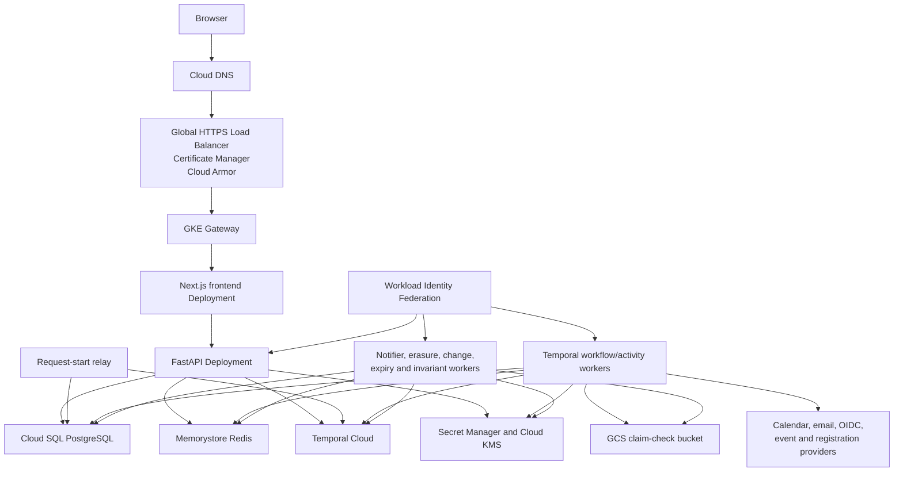

# Events Concierge GCP Deployment Plan

Status: implementation in progress; not production-ready  
Last updated: 2026-08-09  
Target: GCP, initially a zonal GKE Standard cluster with managed state and Temporal Cloud

## Executive decision

Deploy the Events Concierge application processes to Google Kubernetes Engine, but do not
translate the complete local Compose stack one-for-one.

- Keep application Pods stateless.
- Use Cloud SQL for PostgreSQL, Memorystore for Redis, Google Cloud Storage, Cloud KMS, and
  Secret Manager.
- Use Temporal Cloud rather than operating Temporal Server and its persistence database in GKE.
- Use the repository's Terraform/OpenTofu and Helm scaffolds to provision and deploy the reviewed
  platform after environment inputs and credentials are supplied.
- Complete the partial GCP runtime provider inside the installed Python package; do not weaken its
  fail-closed production preflight while required ports remain absent.
- Start with a zonal GKE control plane to use the monthly management-fee credit, while distributing
  worker nodes across three zones.
- Treat migration to a regional GKE control plane as a later blue/green cluster migration.

The estimated launch infrastructure range for a zonal control plane with one
`e2-standard-2` node in each of three zones, managed HA data services, and Temporal Cloud is
approximately **$600–900/month** before application-provider, LLM, browser-fleet, support, tax,
and staging costs. The detailed multi-model TCO analysis is in the
[Notion deployment cost report](https://app.notion.com/p/3b0d865005a8818b8bfec6a9aeb3bc0e).

### Implementation snapshot (2026-08-09)

Repository-owned, offline-validated implementation now includes:

- version-pinned Terraform/OpenTofu modules and a staging composition for network, GKE, managed
  PostgreSQL/Redis, GCS/KMS, Artifact Registry, workload identity, observability, and secret
  containers;
- a Helm chart for the Next.js frontend, internal FastAPI API, split/versioned Temporal workers,
  relays, one-shot CronJobs, migration and application-role-rotation Jobs, Secret Manager CSI
  mounts, Cloud SQL Auth Proxy sidecars, policy, monitoring, and immutable image digests;
- strict mounted-secret loading, explicit database pool budgets, and separate validation for
  direct TLS versus Pod-local Cloud SQL Auth Proxy connections;
- a secure `ec_app` bootstrap plus an audited, opt-in password-rotation command/Job;
- a native GCS claim-check adapter and partial built-in GCP runtime provider; and
- a runtime-configured Next.js same-origin API proxy, so the internal API origin is not baked into
  the frontend image.

This is infrastructure and application scaffolding, not a deployable production service. The GCP
factory still omits notification delivery, a production `NotificationSecretProtector`, the
credential vault/injection broker, and production Google Calendar binding/access. Full production
preflight therefore fails and non-mock application processes cannot start. The current process
composition and chart also mount a shared runtime-secret bundle and grant broader common IAM than
strict per-process least privilege permits. No GCP environment has been provisioned or field-proved
by these offline checks.

## Goals

1. Produce a reproducible GCP environment without long-lived cloud keys.
2. Deploy immutable API, frontend, worker, relay, and scheduled-job images.
3. Preserve the current PostgreSQL outbox and Temporal durability properties.
4. Keep every durable data layer outside Kubernetes at launch.
5. Establish least-privilege workload identities, private data-plane networking, encrypted
   secrets, backups, observability, and an explicit rollback path.
6. Make the initial zonal deployment portable to a regional GKE cluster without changing
   application data services or workflow identities.

## Non-goals for the first production slice

- Self-hosting Temporal, PostgreSQL, or Redis in Kubernetes.
- Deploying the local-only ingestion admin command worker or cadence daemon.
- Claiming the browser automation lane is production-ready.
- Building the documented DBOS fallback.
- Operating a second event broker; PostgreSQL outboxes and Temporal remain the durable transports.
- Building a multi-region application deployment before single-region recovery is proven.

## Current local architecture

The local stack is defined by [docker-compose.yml](../docker-compose.yml). It currently runs:

- Next.js frontend and FastAPI API.
- One compatibility Temporal worker process by default; its code can split transactional and
  catalog registrations, while the production Helm profile runs those roles independently.
- Request-start, notification, account-erasure, change-delivery, handoff-expiry, and
  lifecycle-invariant processes.
- Local-only ingestion-command and ingestion-cadence processes.
- Application PostgreSQL with pgvector.
- Redis.
- A development Temporal Server, separate Temporal PostgreSQL, and Temporal UI.
- A shared filesystem claim-check volume.

The complete running Compose stack was observed at roughly 1.77 GiB RAM and about 11.5% of one CPU
core under low local traffic. The always-running application processes, excluding local ingestion
and local data services, used roughly 845 MiB. These are point-in-time observations, not resource
limits or production capacity measurements; Compose defines no explicit CPU or memory ceilings.

## Current Temporal setup

### Local service

Temporal is currently self-hosted only for development:

- Server image: `temporalio/auto-setup:1.25.2`
- Persistence: separate `postgres:16-alpine`
- UI image: `temporalio/ui:2.32.0`
- Host gRPC endpoint: `127.0.0.1:7234`
- Host UI: `http://127.0.0.1:8234`
- Namespace: `default`
- Compatibility task queue: `events-concierge`; production settings define distinct transactional
  and catalog queues.
- Default worker concurrency: 8 workflow tasks and 8 activities

The Compose file explicitly identifies this as a development server, not a production Temporal
cluster.

### Live observation on 2026-08-02

- Cluster status: `SERVING`
- Namespace retention: 24 hours
- History archival: disabled
- Visibility archival: disabled
- Temporal Schedules: none
- Executions: 20 completed, 0 running, 0 failed
- Types: 4 `CatalogRefreshWorkflow`, 16 `CatalogPagedRefreshWorkflow`
- `EventRequestWorkflow`: 0 observed
- `RegistrationWorkflow`: 0 observed
- Workflow-task backlog: 0
- Activity-task backlog: 0
- Pollers: one workflow poller and one activity poller
- Worker build identity: `UNVERSIONED`
- Example paged-catalog workflow history: 33 events

This proves the catalog wiring works locally. It does not validate production request traffic,
long-running registration workflows, worker high availability, safe workflow-code upgrades, or
Temporal Cloud consumption.

### Temporal code path

```text
POST /v1/requests
  -> PostgreSQL request + request_start_outbox transaction
  -> best-effort immediate start
  -> request-starter replays durable pending starts
  -> EventRequestWorkflow
      -> discovery and ranking activities
      -> RegistrationWorkflow child per selected event
      -> durable confirmation, handoff, calendar, and lifecycle waits
```

The shared client in
[temporal_client.py](../src/events_concierge/workflows/temporal_client.py) supplies namespace,
TLS/API-key authentication, RPC bounds, the claim-check data converter, and workflow-type routing
to transactional or catalog queues. [worker.py](../src/events_concierge/workflows/worker.py)
supports compatibility `combined`, `transactional`, and `catalog` roles. The deployed roles register
only their workflow/activity set and use immutable Temporal Worker Deployment build identities with
pinned behavior; promotion to a current/ramping version remains a release-controller action.

### Local investigation commands

Run these from the repository root:

```bash
docker compose --profile app ps
curl -sS http://127.0.0.1:8000/readyz
docker compose --profile app logs --since=10m \
  temporal temporal-postgres workflow-worker request-starter

docker exec events-concierge-temporal-1 \
  temporal operator cluster health --address temporal:7233

docker exec events-concierge-temporal-1 \
  temporal operator namespace describe \
  --address temporal:7233 --namespace default

docker exec events-concierge-temporal-1 \
  temporal workflow list \
  --address temporal:7233 --namespace default

docker exec events-concierge-temporal-1 \
  temporal task-queue describe \
  --address temporal:7233 --namespace default \
  --task-queue events-concierge --task-queue-type workflow

docker exec events-concierge-temporal-1 \
  temporal task-queue describe \
  --address temporal:7233 --namespace default \
  --task-queue events-concierge --task-queue-type activity

docker exec events-concierge-temporal-1 \
  temporal workflow show \
  --address temporal:7233 --namespace default \
  --workflow-id '<workflow-id>' --detailed
```

Inspect the independent PostgreSQL durability boundary as well:

```bash
docker exec events-concierge-postgres-1 psql -U ec -d ec -c \
"SELECT started_at IS NULL AS pending,
        count(*) AS rows,
        max(attempt_count) AS max_attempts,
        min(next_attempt_at) AS next_attempt
 FROM request_start_outbox
 GROUP BY started_at IS NULL;"
```

For production, the same investigation categories must be available through the Temporal Cloud UI,
Temporal CLI, application queue metrics, and worker telemetry:

- workflow counts by type and status;
- task-queue backlog count and age;
- poller count and worker deployment version;
- schedule-to-start latency;
- workflow-task and activity failures/timeouts/retries;
- history size and history length;
- open and retained storage;
- billable Actions and their workflow-type mix;
- PostgreSQL outbox age while Temporal is unavailable.

## Target GCP architecture



### GKE foundation

- GKE Standard, VPC-native, private worker nodes.
- Initial zonal control plane in `us-west1-a`, subject to final region selection.
- One `e2-standard-2` node in each of three explicitly configured node locations.
- Release channel: Regular or Stable.
- Custom node service account with only node-system and Artifact Registry pull permissions.
- Workload Identity Federation enabled for Pod identities.
- Cloud Router and Cloud NAT for controlled internet egress and Temporal/provider access.
- Non-overlapping subnet, Pod, Service, and Private Service Access address ranges reserved up front.
- Pod topology-spread constraints and disruption budgets for replicated serving workloads.

A three-zone node layout protects against an individual worker-node or node-zone failure. It does
not make a zonal GKE control plane regional. During a control-plane-zone outage, existing workloads
can continue, but scheduling, scaling, rollout, and repair operations may be unavailable.

### Managed state

#### Cloud SQL

- PostgreSQL 16.
- Regional high availability.
- Private IP.
- Automated backups and point-in-time recovery.
- `vector` and `pg_trgm` extensions verified during environment bootstrap.
- Separate migration-owner and non-owner `ec_app` credentials.
- Explicit database connection budgets per process and replica.
- A restore drill before production launch and at a scheduled interval afterward.

The preferred initial connection design is a Cloud SQL Auth Proxy sidecar in every database-using
Pod. The application connects to the sidecar over Pod-local TCP while the proxy uses Workload
Identity and encrypted upstream connections. Production validation now distinguishes this posture:
`EC_DATABASE_CONNECTION_MODE=cloud_sql_proxy` requires a Pod-local `127.0.0.1` endpoint and
`sslmode=disable` only for the already-encrypted proxy hop, while `direct_tls` requires a non-local
host and exactly `sslmode=verify-full`. Each process must declare its bounded pool size, zero
overflow, checkout timeout, and recycle interval; the pool must cover configured activity
concurrency without exceeding the environment-wide Cloud SQL connection budget.

Migration `0002` creates the fixed non-owner `ec_app` role without a source-controlled production
password and accepts the initial password only from `EC_APP_ROLE_PASSWORD(_FILE)`. Because an
already-applied migration cannot rotate that password, later rotation is a distinct maintenance
phase: quiesce application workloads, run the disabled role-rotation Job with the owner URL and the
new password version, require its sanitized success report, and only then deploy the matching new
`EC_DATABASE_URL` secret version. There is no old/new password overlap. A rollback must first rerun
the gated Job with the prior password version and only then restore the prior application DSN.
SQLAlchemy `hide_parameters` protects client logs only; Cloud SQL/PostgreSQL and proxy/audit sinks
must independently disable or redact SQL statement and bind-parameter logging during bootstrap and
rotation.

#### Memorystore

- Memorystore for Redis Standard Tier.
- Private connectivity.
- TLS and AUTH enabled.
- No-eviction behavior chosen explicitly for pacing, browser admission, and OIDC session state.
- Alerts for memory use, rejected connections, evictions, failovers, and latency.

#### GCS claim checks

- Regional Standard bucket in the application region.
- Uniform bucket-level access.
- Public access prevention.
- Customer-managed encryption key if the final threat model requires it.
- No retention lock that would prevent required tenant erasure.
- Lifecycle policy aligned with Temporal history retention and account-erasure requirements.
- Native GCS adapter supporting conditional create, byte-identical retry validation, reads, and
  complete tenant-prefix deletion.

#### Secret Manager and Cloud KMS

Secret Manager holds deployment secrets such as:

- Temporal Cloud API key;
- OIDC client secret;
- database role passwords if password authentication remains selected;
- Redis AUTH secret and CA material where required;
- email-provider credentials;
- provider application credentials.

Dynamic per-tenant OAuth or provider credentials should not become one Secret Manager secret per
user. The intended design is an encrypted durable credential vault using envelope encryption and a
Cloud KMS key, with ciphertext stored in the application data layer and tenant-scoped deletion.

The GKE Secret Manager add-on mounts secrets as files. Runtime settings now accept strict `*_FILE`
references for the database and Redis URLs, Temporal API key, OIDC client secret, and selected model
credentials; migrations separately accept `EC_MIGRATION_URL_FILE` and
`EC_APP_ROLE_PASSWORD_FILE`. A value and its corresponding file reference are mutually exclusive,
and the loader requires a bounded absolute regular UTF-8 file. The current chart still mounts one
shared runtime-secret set into most Python workloads; split that set and its IAM access by process
before claiming least privilege.

### External managed services

- Temporal Cloud namespace per environment.
- OIDC provider; Google Identity Platform or another standards-compliant provider after confirming
  the tenant-claim contract.
- Transactional email provider. Google Cloud has no direct SES equivalent, so select a provider
  such as Postmark, SendGrid, Mailgun, or Mailjet.
- Google Calendar OAuth client and tenant-scoped access-token lifecycle.
- Optional ranking/model providers.
- Future browser fleet and credential injection broker, kept out of the first production claim.

## Compose-to-production workload mapping

All Python processes use one immutable application image with different commands. The frontend uses
its own immutable image.

| Current component | Production object | Initial scale | Dependencies and notes |
|---|---|---:|---|
| `frontend` | Deployment + ClusterIP Service | 2 | Only public application backend. Proxies API paths internally. |
| `api` | Deployment + ClusterIP Service | 2 | Port 8000; `/healthz`, `/readyz`, and `/metrics`. |
| transactional Temporal worker | Deployment, no Service | 2 | Polls the transactional queue with the transactional workflow/activity set and an immutable Worker Deployment build. |
| catalog Temporal worker | Deployment, no Service | 2 | Polls the catalog queue independently with its catalog-only registration set and build identity. |
| `request-starter` | Deployment, no Service | 2 | PostgreSQL leases make replicas safe; monitor oldest pending start. |
| `notifier` | Deployment, no Service | 1–2 | PostgreSQL outbox plus external email provider. |
| `account-erasure` | Deployment, no Service | 1 | Temporal, Calendar, vault, Redis session, and GCS deletion. |
| `change-delivery` | Deployment, no Service | 1 | Projects durable database work and signals Temporal. |
| `handoff-expiry` | CronJob | 1 per schedule | Runs one bounded `--once` repair pass with `concurrencyPolicy: Forbid`. |
| `lifecycle-invariants` | CronJob | 1 per schedule | Runs one bounded nightly `--once` scan with `concurrencyPolicy: Forbid`. |
| `migrate` | Release-gated Job | 1 completion | Receives the migration-owner credential; application Pods never do. |
| `rotate-app-role-password` | Disabled maintenance Job | 1 completion | Uses the migration-owner URL to rotate `ec_app`; must finish before deploying the matching new app DSN. |
| `catalog_refresh_dispatcher` | CronJob | 1 | One bounded pass; `concurrencyPolicy: Forbid`. |
| `catalog_refresh` | Operator-created Job template | On demand | Source-specific diagnostics or controlled manual refresh. |
| `ingestion-commands` | Not deployed | 0 | Explicitly local/mock-only. |
| `ingestion-cadence` | Not deployed | 0 | Explicitly local/mock-only. |
| application `postgres` | Cloud SQL | Managed | Do not deploy a StatefulSet. |
| `redis` | Memorystore | Managed | Do not deploy a Redis StatefulSet. |
| `temporal` | Temporal Cloud | Managed | Do not deploy Temporal Server. |
| `temporal-postgres` | Temporal Cloud | Managed | Do not operate Temporal persistence. |
| `temporal-ui` | Temporal Cloud UI | Managed | No production UI Pod. |
| `claim-check` volume | GCS | Managed | No shared RWX PersistentVolume. |

### Initial resource requests

These values are bootstrap requests based on local observations with headroom for cloud SDKs. They
must be replaced with staging measurements before enabling broad autoscaling.

| Workload | CPU request | Memory request | Suggested initial limit |
|---|---:|---:|---:|
| Frontend | 100m | 128 MiB | 500m / 512 MiB |
| API | 250m | 256 MiB | 1 CPU / 512–768 MiB |
| Temporal worker role | 250m | 384 MiB | 2 CPU / 1 GiB |
| Relays and scanners | 100m | 192 MiB | 500m / 384–512 MiB |

The API and frontend may initially scale on CPU and latency. Temporal workers should eventually
scale on task-queue backlog or schedule-to-start latency rather than CPU alone. Relays should not be
autoscaled until their lease and provider-rate behavior has been load-tested.

## Infrastructure and deployment ownership

### Terraform/OpenTofu

The version-pinned scaffold under [`infra/terraform`](../infra/terraform) validates offline and
defines the staging composition. It has not been applied to a GCP project. Terraform/OpenTofu owns
durable cloud infrastructure:

- projects and required APIs, if project creation is in scope;
- VPC, subnets, secondary ranges, firewall policy, Private Service Access;
- Cloud Router and NAT;
- GKE cluster and node pools;
- Artifact Registry;
- Cloud SQL instance, database, backups, and network attachment;
- Memorystore instance and network attachment;
- GCS buckets;
- Cloud KMS key rings and keys;
- Secret Manager secret containers and IAM policy, but not plaintext values in Terraform state;
- Google service accounts and Workload Identity Federation bindings;
- static addresses, Cloud DNS, certificates, and Cloud Armor policy;
- log sinks, dashboards, alerts, and budgets where provider coverage is appropriate.

Temporal's Terraform provider may manage namespaces and service accounts later. API-key secret
material must not be left in ordinary Terraform state.

### Helm

The chart under [`deploy/helm/events-concierge`](../deploy/helm/events-concierge) lints and renders
all release phases with immutable image digests. It is staging scaffolding, not proof of a successful
cluster rollout. Helm owns namespaced Kubernetes application resources:

- Kubernetes namespace and service accounts;
- frontend/API, relay, and split Temporal-worker Deployments plus Services;
- Gateway/HTTPRoute resources or the chosen GKE ingress integration;
- separate migration and disabled-by-default `ec_app` password-rotation Jobs;
- catalog, handoff-expiry, and lifecycle-invariant one-shot CronJobs;
- ConfigMaps and secret-file mounts;
- NetworkPolicies;
- PodDisruptionBudgets and topology-spread constraints;
- resource requests/limits and HPAs;
- PodMonitoring resources;
- Cloud SQL Auth Proxy sidecars.

Keep Terraform and Helm release lifecycles separate. Terraform provisions the platform; CI/CD
deploys an immutable Helm release onto it.

### Python runtime provider

The runtime provider is imported into each Python process. It is not another Pod and is not
replaced by Terraform.

The installed package contains the current partial implementation at
[`gcp_runtime.py`](../src/events_concierge/deployment/gcp_runtime.py). Configure it with:

```text
EC_RUNTIME_PROVIDER_FACTORY=events_concierge.deployment.gcp_runtime:build_runtime_ports
```

The provider currently constructs the native GCS `ObjectStorePort`, reviewed public discovery,
PostgreSQL action-audit and consent repositories, intentionally empty registration/withdrawal maps,
and Google Calendar only when a separately supplied access factory is enabled. The GCS client uses
Application Default Credentials lazily, and immutable generation-zero writes accept a retry only
when stored bytes match.

Before the provider is production-complete, it must additionally construct non-mock implementations
for:

- notification delivery;
- Cloud KMS notification-secret protection;
- encrypted `CredentialVault`;
- tenant-scoped production Calendar binding/access; and
- any enabled source-specific mutation boundaries.

Until every required port is callable, full production validation and non-mock composition fail
closed by design. GCP client libraries should use Application Default Credentials obtained through
Workload Identity Federation and avoid unnecessary startup network I/O.

### CI/CD

#### Current GitHub Actions pipeline

The repository uses GitHub Actions through `.github/workflows/ci.yml` and the separate
`.github/workflows/deployment-validation.yml`. They run repository and offline deployment checks;
neither authenticates to or deploys GCP.

| Job | What it validates today |
| --- | --- |
| `static-and-unit` | Locked Python dependencies, structural production preflight, Ruff, mypy, and unit tests |
| `web` | Locked Node dependencies, frontend type/behavior/runtime-proxy tests, and production Next.js build |
| `integration-and-quality` | Docker Compose integration suite, bounded quality-load runs, and a local PostgreSQL backup/restore drill |
| `browser-e2e` | Playwright browser tests in Chromium |
| `container` | Compose validation, explicit Python/frontend image builds, image policy checks, candidate-stack startup, canary checks, and process-liveness checks |
| deployment validation | OpenTofu format/init/validate plus strict Helm lint, release-phase rendering, and deployment-invariant checks |

This is a good validation baseline, but it is not yet a complete release pipeline. It does not
publish the built images, authenticate to GCP, produce an authenticated infrastructure plan, deploy
to GKE, execute the rendered Jobs against Cloud SQL, or verify and promote a deployed release.

#### Target GCP delivery pipeline

Keep GitHub Actions as the CI/CD orchestrator initially. There is no strong reason to add Cloud
Build or Cloud Deploy for the first production version. Use GitHub OIDC with GCP Workload Identity
Federation, so Actions receives short-lived credentials and no service-account JSON key is stored in
GitHub.

Split responsibilities into the following workflows:

| Workflow | Trigger | Responsibility |
| --- | --- | --- |
| `ci.yml` | Pull request and push | Existing tests plus Helm lint/render, Kubernetes schema validation, Terraform formatting/validation, explicit builds of both images, and Temporal replay/compatibility checks |
| `infra-plan.yml` | Pull request touching infrastructure | Produce a read-only Terraform plan and retain it as a review artifact |
| `infra-apply.yml` | Manual dispatch from a protected environment | Apply a reviewed infrastructure change using a narrowly scoped deploy identity |
| `release.yml` | Merge to `main` or version tag | Build each image once, scan it, push it to Artifact Registry, and record immutable image digests and source revision |
| `deploy-staging.yml` | Successful release | Run production preflight, run the schema migration Job, deploy the recorded digests with Helm, wait for rollout, and run HTTP plus bounded Temporal smoke tests |
| `promote-production.yml` | Manual approval in the protected `production` GitHub Environment | Promote the exact staging-tested digests, run compatible migrations, deploy, canary, and record the release |

#### Deployment control model

Use a push-based deployment model initially: GitHub Actions authenticates with short-lived GCP
credentials, obtains narrowly scoped access to the target GKE namespace, and executes the migration
Job and `helm upgrade --install`. This keeps the first delivery path small and reuses the CI system
already present in the repository.

Kubernetes still pulls container images from Artifact Registry in this model. “Push” versus “pull”
here describes how desired Kubernetes state reaches the cluster:

| Model | How desired state reaches GKE | Recommendation |
| --- | --- | --- |
| GitHub Actions push | A protected Actions job invokes Helm against the GKE API | Use for the first dev, staging, and production-shaped releases |
| Cloud Deploy | GitHub creates a release; GCP renders, promotes, verifies, and rolls it out through managed targets | Consider when staging-to-production promotion, managed approvals, or canary rollout becomes valuable enough to justify Skaffold and another delivery abstraction |
| Pull-based GitOps | Flux, Argo CD, or Config Sync runs in or alongside the cluster and continuously reconciles Git/OCI desired state | Defer until drift correction, multiple clusters, multiple application teams, or a requirement to remove direct cluster-write access from CI warrants another controller and source-of-truth workflow |

The initial push workflow must still be declarative: Helm values are versioned, images are pinned by
digest, deployment concurrency is one per environment, and CI records the deployed Git revision and
digests. A pull-based controller can be introduced later without rebuilding the images or chart.

#### Delivery maturity sequence

Do not implement every target workflow before the first remote deployment.

1. **First GKE development deployment:** retain the committed offline deployment-validation workflow,
   then add one manually triggered deployment workflow that authenticates through Workload Identity
   Federation, publishes the selected application images to Artifact Registry, runs the migration
   Job, deploys by digest, waits for readiness, and runs a smoke test.
2. **First persistent staging environment:** automatically deploy successful `main` releases, retain
   release digests, add basic vulnerability scanning, and exercise restore plus rollback procedures.
3. **Before production traffic:** require an explicit protected-environment approval, promote the
   exact digests proven in staging, enforce expand/contract database migrations, and gate Temporal
   workflow changes with replay/versioning checks.
4. **Later maturity:** introduce Cloud Deploy for managed promotions/canaries or pull-based GitOps
   for continuous reconciliation; add signing and Binary Authorization when supply-chain policy,
   team size, or compliance justifies enforcement.

The committed topology requires the Next.js frontend image as the production public surface. Image
signing is not a prerequisite for the first development cluster. Temporal replay is not useful
before durable remote workflow histories exist, but becomes a release requirement before upgrading
workflow code against retained staging or production histories.

The application delivery pipeline should:

1. Run lint, type checking, unit, integration, browser, and operations tests.
2. Build the Python and frontend images once.
3. Scan and optionally sign images.
4. Push to Artifact Registry.
5. Resolve and retain immutable image digests.
6. Run the production configuration preflight using the real runtime provider.
7. Create and wait for the migration Job.
8. Deploy the Helm release by digest.
9. Wait for rollouts and Temporal pollers.
10. Run the HTTP canary and a bounded workflow smoke test.
11. Retain the previous release values and digests for rollback.

GitHub Actions should authenticate to GCP with Workload Identity Federation/OIDC. Do not store a
service-account JSON key in repository secrets.

## Networking and identity model

### Ingress

- Cloud DNS resolves the public application domain to the global HTTPS load balancer.
- Certificate Manager owns TLS certificates.
- Cloud Armor supplies baseline edge policy and rate controls.
- Only the frontend Service is public when the Next.js same-origin proxy is selected.
- The FastAPI Service remains ClusterIP-only.
- Administrative ingestion endpoints remain disabled in production.

The committed chart selects Next.js as the public surface and keeps FastAPI internal. Next.js owns
runtime route handlers for `/v1`, `/auth`, `/healthz`, and `/readyz`; they resolve `EC_API_ORIGIN` at
request time, enforce bounded paths/headers/bodies, and preserve same-origin cookies and redirects.
This removes the old build-time service-name rewrite. A frontend-local shallow liveness route and a
proxied API readiness route keep process health distinct from dependency readiness.

### Egress

Private GKE nodes require controlled egress for:

- Temporal Cloud on TLS port 7233;
- OIDC discovery/token/JWKS endpoints;
- email and Calendar APIs;
- reviewed event sources;
- optional ranking/model providers;
- Google APIs required by Workload Identity, Secret Manager, KMS, and Cloud SQL connectors.

Use Cloud NAT with explicit logs and budget monitoring. Preserve a stable outbound IP where provider
allowlists require it.

### Workload identities

Create separate Kubernetes service accounts and IAM bindings for at least:

- frontend;
- API;
- transactional and catalog Temporal worker roles;
- request starter;
- notifier;
- account erasure;
- catalog jobs;
- migration Job;
- CI/CD deployer.

The chart creates distinct Kubernetes service accounts, but current runtime composition builds the
complete dependency graph in every Python process and mounts a shared runtime-secret set into most
of them. This still forces overly broad common configuration and IAM. Introduce process-specific
composition/secret bundles before claiming strict least privilege; until then, record the temporary
shared permissions and an expiration/remediation owner.

## Production code gaps

### Completed repository-owned hardening

- Native GCS conditional-create/read/all-generation tenant-purge behavior and the partial installed
  GCP provider.
- Cloud SQL Auth Proxy-aware validation, explicit zero-overflow connection pools, strict mounted
  secret loading, secure `ec_app` bootstrap, and a separate sanitized role-rotation operation.
- Distinct transactional/catalog task queues, worker roles, and Temporal Worker Deployment
  versioning configuration.
- Bounded `--once` handoff-expiry and lifecycle-invariant commands packaged as CronJobs.
- Terraform/OpenTofu modules, Helm packaging, offline deployment validation, and the runtime Next.js
  proxy.

### Release blockers

1. **Incomplete non-mock runtime graph:** the included GCP factory intentionally omits the notifier,
   production notification-secret protector, credential vault/injection broker, and usable
   production Calendar binding/access. Full preflight fails and `EC_MOCK_CLOUD=false` processes do
   not start.
2. **Provider and identity provisioning absent:** no notification provider/domain/event pipeline,
   Calendar OAuth lifecycle, real IdP registration/account provisioning, or mutation-provider
   credential boundary is configured or field-proved.
3. **Process least privilege incomplete:** shared runtime composition, secret mounts, and common IAM
   remain broader than each process needs.
4. **No applied environment or release controller:** Terraform and Helm validate offline, but no
   authenticated plan/apply, GKE rollout, Cloud SQL migration/rotation run, provider canary, or
   immutable release promotion has occurred.
5. **Recovery/operations evidence absent:** managed PITR restore, Temporal Cloud recovery/deletion,
   GCS/KMS recovery and tenant purge, alerting, on-call, security review, and rollback drills remain
   external gates.

### Required remaining Temporal hardening

1. Add worker heartbeat, poller, backlog, retry, and stuck-lease telemetry and alerting.
2. Review activities that inherit default retry behavior and add schedule-to-close bounds where
   appropriate.
3. Add heartbeats to genuinely long-running activities.
4. Choose namespace retention, deletion, export/archival, capacity, and API-key rotation policies.
5. Prove the account-erasure workflow-history deletion behavior against Temporal Cloud.
6. Exercise `EventRequestWorkflow` and long-lived `RegistrationWorkflow` in a production-shaped
   staging load test, including Worker Deployment promotion and rollback.
7. Implement or identify the production caller for `confirmation_received` before claiming the
   confirmation path is complete.

### Other known gaps

- No production browser-fleet worker or credential injection broker.
- No live central provider change detector.
- No Google Calendar webhook receiver.
- No notification delivery-event ingestion pipeline.

## Phased implementation plan

### Phase 0 — Decisions and repository contracts

Deliverables:

- Ratify GCP region, initial zone, project/environment layout, and public domain.
- Preserve the committed Next.js-public/FastAPI-internal topology in edge and canary evidence.
- Select OIDC and email providers.
- Define staging and production namespace names.
- Define RPO, RTO, retention, and budget thresholds.
- Decide whether project creation and Cloud DNS are managed by Terraform.
- Record an explicit browser/provider-lane launch boundary.

Exit criteria:

- No unresolved choice changes network, identity, database, or public-edge topology.

### Phase 1 — Application deployment readiness

Implemented repository slice:

- Partial GCP runtime provider installed in the application image.
- Native GCS claim-check adapter and tests.
- Strict secret-file settings support.
- Secure `ec_app` bootstrap and explicit maintenance rotation.
- Explicit process-level database pool configuration.
- Cloud SQL Auth Proxy-aware production validation.
- Runtime Next.js proxy with separate frontend liveness and proxied readiness.
- Temporal task-queue split, worker roles, and Worker Deployment versioning configuration.

Remaining deliverables:

- Wire a production notification channel and `NotificationSecretProtector` into the GCP provider.
- Implement the separately isolated encrypted credential vault/injection broker.
- Provision and field-prove tenant-scoped production Calendar access/bindings.
- Narrow composition, mounted secrets, and IAM per process.
- Complete worker metrics/health and provider-delivery evidence.

Exit criteria:

- Full production configuration validation passes locally with hermetic fakes.
- Images contain every configured factory and entrypoint.
- No literal production credential exists in source, image, Terraform variables, or state.

### Phase 2 — GCP foundation IaC (offline scaffold complete; apply pending)

Suggested repository shape:

```text
infra/
  terraform/
    modules/
      project-services/
      network/
      gke/
      managed-state/
      storage-kms/
      artifact-registry/
      workload-identity/
      observability/
    environments/
      staging/
      production/
deploy/
  helm/
    events-concierge/
```

Deliverables:

- Version-pinned providers and remote Terraform state.
- Network, GKE, managed state, registry, keys, secrets, IAM, and budget resources.
- No plaintext secret values in state.
- A least-privilege Terraform deployment identity.
- Reviewed `terraform plan` evidence.

Exit criteria:

- A clean plan is reproducible from a documented identity.
- Policy checks reject public databases, public buckets, broad workload identities, and unbounded
  production node pools.

### Phase 3 — Helm packaging complete; staging deployment pending

Deliverables:

- Reusable templates for the shared Python image and command overrides.
- Frontend/API Services and public Gateway route.
- Deployments, Jobs, CronJobs, probes, resources, PDBs, topology spread, and NetworkPolicies.
- Workload Identity-linked Kubernetes service accounts.
- Cloud SQL Auth Proxy native sidecars for database-using Pods and Jobs.
- Secret Manager mounts.
- PodMonitoring and log/alert integration.

Exit criteria:

- Staging installs from an empty namespace.
- Migration Job succeeds exactly once.
- Rollout and rollback by image digest succeed.
- No local-only Compose service appears in staging.

### Phase 4 — Temporal Cloud and end-to-end validation

Deliverables:

- Staging Temporal namespace and namespace-scoped service account.
- API key stored directly in Secret Manager and rotation runbook.
- Two versioned Temporal worker replicas.
- Catalog and transactional task queues with separate monitoring.
- Request/outbox outage drill.
- Workflow replay and compatibility gate.
- One end-to-end request plus registration/handoff/confirmation lifecycle.
- Temporal Actions and storage baseline measurement.

Exit criteria:

- A Temporal outage buffers new requests without losing them.
- Recovery drains the start outbox without duplicate externally visible effects.
- Worker replacement and rollback do not cause nondeterminism errors.
- Queue backlog and schedule-to-start alerts are demonstrated.

### Phase 5 — Production launch

Deliverables:

- Production Cloud SQL restore test.
- Redis failure/failover test.
- GCS tenant deletion proof.
- KMS and API-key rotation tests.
- Capacity and cost alarms.
- Security review and dependency/image scan evidence.
- On-call alerts and runbooks.
- DNS/TLS cutover and rollback plan.

Exit criteria:

- Release canary, workflow smoke, backup/restore, erasure, and rollback gates all pass.
- Named owners accept remaining non-blocking risks.

### Phase 6 — Regional GKE migration

A zonal GKE cluster cannot be converted into a regional cluster. Use a controlled blue/green move:

1. Create a separate regional GKE cluster in the same region and VPC.
2. Reserve distinct destination Pod and Service ranges.
3. Install identical Workload Identity, secret, monitoring, Gateway, and policy configuration.
4. Deploy the same image digests first.
5. Point both clusters at the same Cloud SQL, Redis, GCS, KMS, and Temporal namespace.
6. Use expand/contract database changes compatible with both clusters.
7. Allow compatible versioned Temporal workers in both clusters to poll concurrently.
8. Canary and shift HTTP traffic gradually.
9. Stop old serving workloads, drain old workers, and retain the source cluster for rollback.
10. Destroy the old cluster only after the rollback window closes.

Do not mutate the Terraform zonal cluster resource into a regional resource and permit an implicit
replacement. Model the destination as a separately named resource and state transition.

## Observability and operational gates

### Application

- API availability, latency, error rate, and saturation.
- Database and identity readiness.
- PostgreSQL pool checkout latency and exhaustion.
- Durable queue pending count and oldest-ready age.
- Provider latency, rate limiting, and circuit/quarantine state without tenant identifiers in labels.
- Release revision and image digest.

### Temporal

- Poller count by queue and build/deployment version.
- Workflow/activity task backlog and oldest task age.
- Schedule-to-start latency.
- Workflow-task failures, nondeterminism, timeouts, and stuck executions.
- Activity retry/failure/timeout rates.
- History length/size and continue-as-new rate.
- Open workflow count, Actions, active storage, and retained storage.

### Managed state

- Cloud SQL CPU, memory, storage, connections, replication/failover, backup, and PITR health.
- Redis memory, connections, latency, rejected connections, evictions, and failover.
- GCS request failures, storage growth, lifecycle deletion, and tenant-purge failures.
- KMS error and latency rates.

### Cost

- GKE nodes and autoscaling bounds.
- Logging ingestion and retention.
- NAT and internet egress.
- Cloud SQL storage/backups.
- Temporal Actions and storage.
- Provider APIs, email, model, and future browser fleet spend.

## Access and inputs needed

### No GCP admin key is required

Do not create, download, or share a long-lived service-account JSON key. In particular, do not paste
cloud, Temporal, database, OIDC, or provider secrets into chat, source files, `.env` files committed
to Git, Terraform variables, or ordinary Terraform state.

Repository planning, application changes, Terraform scaffolding, Helm packaging, and offline tests
can begin with **no GCP access at all**.

### Inputs needed before provisioning

Provide non-secret identifiers and decisions:

- existing GCP organization ID and folder ID, if applicable;
- billing account ID, only if Terraform will create/link projects;
- existing or desired staging and production project IDs;
- primary region and initial GKE control-plane zone;
- public domain and whether its DNS zone is already in Cloud DNS;
- GitHub organization/repository and protected deployment environment names;
- desired monthly budget and alert recipients/thresholds;
- Temporal Cloud account/namespace naming convention;
- OIDC provider and required tenant claim;
- email provider;
- RPO, RTO, database retention, Temporal retention, and rollback-window targets.

None of these values is a credential.

### Human bootstrap authentication

For an existing project, use the operator's normal Google identity through `gcloud` and Application
Default Credentials. Prefer a short bootstrap session that creates a dedicated Terraform service
account and then uses service-account impersonation.

Typical local authentication verification is:

```bash
gcloud auth login
gcloud auth application-default login
gcloud auth list
gcloud config set project '<project-id>'
gcloud projects describe '<project-id>'
```

The exact bootstrap roles depend on whether the project, billing link, DNS zone, and organization
policies already exist. Avoid granting Owner merely for convenience. The bootstrap operator needs
only the capabilities required to:

- create or select the target project and link billing, when in scope;
- enable required APIs;
- create the Terraform and CI service accounts;
- configure IAM and Workload Identity Federation;
- create the remote Terraform state bucket;
- inspect applicable organization policies.

After bootstrap, Terraform should impersonate its deployment service account. GitHub Actions should
exchange its OIDC token through Workload Identity Federation and impersonate the CI deployer. GKE
Pods should use Workload Identity Federation for GKE. No stage needs an exported JSON key.

### Secret installation

When secret resource containers exist, secret values should be created directly by an authorized
operator or provider workflow in Secret Manager. Implementation and review use secret resource
names and placeholders only. Examples include:

- `events-temporal-api-key`
- `events-oidc-client-secret`
- `events-db-app-password`
- `events-db-owner-password`
- `events-email-provider-key`

The deployment identity may receive access to selected secret versions, but Terraform does not need
to know their plaintext values.

## Information required to begin each work stage

| Work stage | Required from the owner |
|---|---|
| Write docs and scaffold code/IaC | Nothing beyond repository access |
| Finalize architecture variables | Project IDs, region/zone, domain, environment names, budget |
| Run Terraform validation locally | No cloud access for `fmt`/`validate`; provider downloads may require network access |
| Run a real Terraform plan | Authenticated `gcloud` session with read access or Terraform-SA impersonation |
| Provision staging | Approved plan and short-lived impersonated deployment authority |
| Connect Temporal Cloud | Namespace endpoint/name and a Secret Manager secret populated out of band |
| Configure OIDC/email | Provider metadata plus secrets populated directly in Secret Manager |
| Deploy from CI | GitHub OIDC trust and an impersonated CI service account |
| Launch production | Explicit approval of plan, migration, DNS cutover, and remaining risks |

## Open decisions

- Final GCP region and initial control-plane zone.
- One project per environment versus a shared non-production project.
- OIDC provider and tenant-claim provisioning model.
- Transactional email provider.
- Cloud SQL password authentication versus a future IAM database-authentication migration.
- Temporal namespace retention and export requirements.
- GCS versioning/lifecycle configuration compatible with tenant erasure.
- Initial application availability target on a zonal control plane.
- RPO, RTO, and rollback-window values.
- Whether staging is always-on or created on demand.
- Timeline for browser-fleet and live registration-provider enablement.

## Initial definition of done

The first production-shaped GCP deployment is complete when:

- Terraform/OpenTofu reproducibly provisions the reviewed GCP platform.
- No service-account JSON key is created or stored.
- Helm installs all intended workloads by immutable digest.
- Local-only and self-hosted data/Temporal containers are absent.
- The production runtime provider loads and every required non-mock port passes preflight.
- Migrations use a separate owner credential and application Pods connect only as `ec_app`.
- Cloud SQL, Redis, GCS, KMS, Secret Manager, and Temporal Cloud connectivity is proven.
- At least two API, frontend, and Temporal worker replicas are distributed across nodes/zones.
- A request survives a simulated Temporal outage and later starts exactly once.
- Worker rollout and rollback are compatible with open workflow histories.
- Backup/restore, account erasure, secret rotation, and rollback drills pass.
- Monitoring and cost alerts fire in a controlled test.
- Remaining disabled product lanes are stated honestly in the release evidence.

## Primary references

- [GKE pricing](https://cloud.google.com/kubernetes-engine/pricing)
- [GKE cluster configuration choices](https://docs.cloud.google.com/kubernetes-engine/docs/concepts/configuration-overview)
- [Workload Identity Federation for GKE](https://docs.cloud.google.com/kubernetes-engine/docs/concepts/workload-identity)
- [Workload Identity Federation for deployment pipelines](https://docs.cloud.google.com/iam/docs/workload-identity-federation-with-deployment-pipelines)
- [Use Artifact Registry with GKE](https://docs.cloud.google.com/artifact-registry/docs/integrate-gke)
- [Connect GKE to Cloud SQL for PostgreSQL](https://docs.cloud.google.com/sql/docs/postgres/connect-kubernetes-engine)
- [Cloud SQL Auth Proxy](https://docs.cloud.google.com/sql/docs/postgres/sql-proxy)
- [Secret Manager add-on for GKE](https://docs.cloud.google.com/secret-manager/docs/secret-manager-managed-csi-component)
- [Memorystore in-transit encryption](https://docs.cloud.google.com/memorystore/docs/redis/manage-in-transit-encryption)
- [Managed Service for Prometheus](https://docs.cloud.google.com/stackdriver/docs/managed-prometheus)
- [Cloud Deploy overview](https://docs.cloud.google.com/deploy/docs/overview)
- [Artifact Analysis container scanning](https://docs.cloud.google.com/artifact-analysis/docs/container-scanning-overview)
- [Binary Authorization overview](https://docs.cloud.google.com/binary-authorization/docs/overview)
- [GKE Config Sync overview](https://docs.cloud.google.com/kubernetes-engine/config-sync/docs/overview)
- [Kubernetes container image names and pull policy](https://kubernetes.io/docs/concepts/containers/images/)
- [Flux reconciliation concepts](https://fluxcd.io/flux/concepts/)
- [Temporal Cloud API keys](https://docs.temporal.io/cloud/api-keys)
- [Temporal Worker deployments and versioning](https://docs.temporal.io/production-deployment/worker-deployments)
- [Temporal Visibility](https://docs.temporal.io/visibility)
